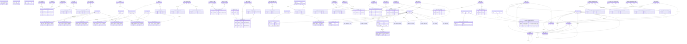

```mermaid

erDiagram
    %% =========================================================
    %% lake__auth0__prod (A0P)
    %% ---------------------------------------------------------
    A0P_main {
        string _fivetran_id PK
        string user_id FK
    }
    A0P_user_metadata {
        string name PK
        string users_id FK
    }
    %% Note: A0P tables refer to 'users.id', which is external to the defined tables.

    %% =========================================================
    %% lake__engine_server__prod (ESP)
    %% ---------------------------------------------------------
    ESP_whisper_waiting_clients {
        string _id PK
        string data
    }

    %% =========================================================
    %% lake__freshservice__prod (FSP)
    %% Explicit FK definitions
    %% ---------------------------------------------------------
    FSP_service_user {
        integer id PK
    }
    FSP_department {
        integer id PK
    }
    FSP_vendor {
        integer id PK
    }
    FSP_service_group {
        integer id PK
    }
    FSP_ticket {
        integer id PK
    }
    
    FSP_purchase_order {
        integer id PK
        integer created_by FK "service_user.id"
        integer department_id FK "department.id"
        integer vendor_id FK "vendor.id"
    }
    FSP_ticket_tag {
        integer ticket_id PK, FK "ticket.id"
        string tag_name PK
    }
    FSP_user_group {
        integer group_id PK, FK "service_group.id"
        integer user_id PK, FK "service_user.id"
    }

    FSP_service_user ||--o{ FSP_purchase_order : created_by
    FSP_department ||--o{ FSP_purchase_order : department_id
    FSP_vendor ||--o{ FSP_purchase_order : vendor_id
    FSP_ticket }|--|| FSP_ticket_tag : ticket_id
    FSP_service_group }|--o{ FSP_user_group : group_id
    FSP_service_user }|--o{ FSP_user_group : user_id

    %% =========================================================
    %% lake__hubspot__prod (HSP)
    %% Explicit FK definitions (Implicit tables derived from FK names: contact, company, deal, quote, owner, team)
    %% ---------------------------------------------------------
    HSP_contact {
        integer id PK
    }
    HSP_company {
        integer id PK
    }
    HSP_deal {
        integer deal_id PK
    }
    HSP_quote {
        integer id PK
    }
    HSP_owner {
        integer owner_id PK
    }
    HSP_team {
        integer id PK
    }
    
    HSP_contact_company {
        integer company_id PK, FK "company.id"
        integer contact_id PK, FK "contact.id"
    }
    HSP_contact_contact {
        integer from_contact_id PK, FK "contact.id"
        integer to_contact_id PK, FK "contact.id"
    }
    HSP_deal_company {
        integer company_id PK, FK "company.id"
        integer deal_id PK, FK "deal.deal_id"
    }
    HSP_deal_contact {
        integer contact_id PK, FK "contact.id"
        integer deal_id PK, FK "deal.deal_id"
    }
    HSP_quote_company {
        integer company_id PK, FK "company.id"
        integer quote_id PK, FK "quote.id"
    }
    HSP_quote_contact {
        integer contact_id PK, FK "contact.id"
        integer quote_id PK, FK "quote.id"
    }
    HSP_quote_deal {
        integer deal_id PK, FK "deal.deal_id"
        integer quote_id PK, FK "quote.id"
    }
    HSP_team_user {
        integer team_id PK, FK "team.id"
        integer user_id PK, FK "users.id"
    }
    
    HSP_contact }|--o{ HSP_contact_company : contact_id
    HSP_company }|--o{ HSP_contact_company : company_id
    HSP_contact }|--o{ HSP_contact_contact : Self_Reference_1
    HSP_contact }|--o{ HSP_contact_contact : Self_Reference_2
    HSP_deal }|--o{ HSP_deal_company : deal_id
    HSP_company }|--o{ HSP_deal_company : company_id
    HSP_deal }|--o{ HSP_deal_contact : deal_id
    HSP_contact }|--o{ HSP_deal_contact : contact_id
    HSP_owner ||--o{ HSP_deal : owner_id
    HSP_team ||--o{ HSP_deal : team_id
    HSP_quote ||--o{ HSP_quote_company : quote_id
    HSP_company ||--o{ HSP_quote_company : company_id
    HSP_quote ||--o{ HSP_quote_contact : quote_id
    HSP_contact ||--o{ HSP_quote_contact : contact_id
    HSP_quote ||--o{ HSP_quote_deal : quote_id
    HSP_deal ||--o{ HSP_quote_deal : deal_id
    HSP_team }|--o{ HSP_team_user : team_id

    %% =========================================================
    %% lake__pocketalk_center_s3__prod (PCSP)
    %% Implicit Measured Value table based on FK
    %% ---------------------------------------------------------
    PCSP_measured_value {
        integer id PK
    }
    PCSP_measured_value_main {
        integer id PK
        integer measured_id FK "measured_value.id"
    }
    PCSP_measured_translation_value {
        integer id PK
        integer measured_id FK "measured_value.id"
    }
    
    PCSP_measured_value ||--o{ PCSP_measured_value_main : measured_id
    PCSP_measured_value ||--o{ PCSP_measured_translation_value : measured_id

    %% =========================================================
    %% lake__ptpay_s3__prod (PTP)
    %% Explicit FK definitions
    %% ---------------------------------------------------------
    PTP_ptpf_cmn_staffs {
        string staff_code PK
    }
    PTP_ptpf_cmn_roles {
        integer role_id PK
    }
    PTP_ptpf_cmn_staff_roles {
        integer staff_role_id PK
        string staff_code FK "ptpf_cmn_staffs.staff_code"
        integer role_id FK "ptpf_cmn_roles.role_id"
    }
    
    PTP_ptpf_cmn_staffs ||--o{ PTP_ptpf_cmn_staff_roles : staff_code
    PTP_ptpf_cmn_roles ||--o{ PTP_ptpf_cmn_staff_roles : role_id

    %% =========================================================
    %% lake__sanwa_wms__prod (SWP)
    %% Composite Keys and FK definitions (Implicit tables: order_main, client_mst, product_mst)
    %% ---------------------------------------------------------
    SWP_order_main {
        string order_brn PK
        integer orderno PK
        string cl_orderno
    }
    SWP_client_mst {
        string client_cd PK
    }
    SWP_product_mst {
        string client_cd PK, FK "client_mst.client_cd"
        string product_cd PK
    }
    
    SWP_order_sub {
        string order_brn PK, FK "order_main.order_brn"
        integer orderno PK, FK "order_main.orderno"
        integer order_seq PK
        string client_cd FK "client_mst.client_cd"
        string product_cd FK "product_mst.product_cd"
    }
    
    SWP_order_main }|--|| SWP_order_sub : Composite_Order_Key
    SWP_client_mst ||--o{ SWP_order_sub : client_cd
    SWP_product_mst ||--o{ SWP_order_sub : product_cd
    SWP_client_mst ||--o{ SWP_product_mst : client_cd

    %% =========================================================
    %% lake__salesforce__prod (SFP)
    %% Explicit FK definitions and self-references (Implicit tables: user, contact, account, record_type, individual)
    %% ---------------------------------------------------------
    SFP_user {
        string id PK
    }
    SFP_account {
        string id PK
    }
    SFP_contact {
        string id PK
    }
    SFP_record_type {
        string id PK
    }
    SFP_asset {
        string id PK
    }
    SFP_contract {
        string id PK
    }
    SFP_event {
        string id PK
    }

    SFP_account ||--o{ SFP_account : parent_id
    SFP_contact ||--o{ SFP_account : person_contact_id
    SFP_user ||--o{ SFP_account : owner_id
    SFP_record_type ||--o{ SFP_account : record_type_id
    
    SFP_account ||--o{ SFP_contact : account_id
    SFP_contact ||--o{ SFP_contact : reports_to_id
    SFP_user ||--o{ SFP_contact : owner_id
    SFP_record_type ||--o{ SFP_contact : record_type_id
    
    SFP_account ||--o{ SFP_asset : account_id
    SFP_contact ||--o{ SFP_asset : contact_id
    SFP_asset ||--o{ SFP_asset : parent_id
    SFP_asset ||--o{ SFP_asset : root_asset_id
    SFP_user ||--o{ SFP_asset : owner_id
    
    SFP_account ||--o{ SFP_contract : account_id
    SFP_contact ||--o{ SFP_contract : customer_signed_id
    SFP_user ||--o{ SFP_contract : owner_id

    SFP_account ||--o{ SFP_event : account_id
    SFP_user ||--o{ SFP_event : owner_id

    %% =========================================================
    %% lake__shopify__prod (SHP)
    %% Explicit FK definitions (Implicit tables: customer, order, user, product)
    %% ---------------------------------------------------------
    SHP_customer {
        integer id PK
    }
    SHP_order {
        integer id PK
    }
    SHP_user {
        integer id PK
    }
    SHP_product {
        integer id PK
    }
    SHP_draft_order {
        integer id PK
        integer customer_id FK "customer.id"
        integer order_id FK "order.id"
    }

    SHP_abandoned_checkout {
        integer id PK
        integer customer_id FK "customer.id"
        integer user_id FK "user.id"
    }
    SHP_order_line {
        integer id PK
        integer order_id FK "order.id"
        integer product_id FK "product.id"
    }
    SHP_shopify_order_serial {
        integer order_id FK "order.id"
        integer product_id FK "product.id"
    }
    SHP_order_risk {
        integer id PK
        integer order_id FK "order.id"
    }
    SHP_draft_order_tag {
        integer draft_order_id PK, FK "draft_order.id"
        integer index PK
    }

    SHP_customer ||--o{ SHP_abandoned_checkout : customer_id
    SHP_user ||--o{ SHP_abandoned_checkout : user_id
    SHP_customer ||--o{ SHP_order : customer_id
    SHP_user ||--o{ SHP_order : user_id
    SHP_order ||--o{ SHP_draft_order : order_id
    SHP_customer ||--o{ SHP_draft_order : customer_id
    SHP_draft_order }|--o{ SHP_draft_order_tag : draft_order_id
    SHP_order ||--o{ SHP_order_line : order_id
    SHP_product ||--o{ SHP_order_line : product_id
    SHP_order ||--o{ SHP_shopify_order_serial : order_id
    SHP_product ||--o{ SHP_shopify_order_serial : product_id
    SHP_order ||--o{ SHP_order_risk : order_id
    
    %% Other tables linked only to SHP_order: order_discount_code, order_note_attribute, order_risk_assessment, order_risk_summary, order_shipping_line, order_tag, order_url_tag
    SHP_order }|--o{ SHP_order_discount_code : order_id
    SHP_order }|--o{ SHP_order_note_attribute : order_id
    SHP_order }|--o{ SHP_order_risk_assessment : order_id
    SHP_order }|--o{ SHP_order_risk_summary : order_id
    SHP_order }|--o{ SHP_order_shipping_line : order_id
    SHP_order }|--o{ SHP_order_tag : order_id
    SHP_order }|--o{ SHP_order_url_tag : order_id

    %% =========================================================
    %% lake__stpay_aws_rds__prod (STP)
    %% Implicit Product Info table based on FK
    %% ---------------------------------------------------------
    STP_expired_product_info {
        integer id PK
    }
    STP_purchase_history {
        integer id PK
        integer product_id FK "expired_product_info.id"
    }
    
    STP_expired_product_info ||--o{ STP_purchase_history : product_id

    %% =========================================================
    %% lake__stripe__prod (SRP)
    %% Explicit FK definitions (Implicit tables: account, person, tax_rate, customer, coupon, invoice, price)
    %% ---------------------------------------------------------
    SRP_account {
        string id PK
        string individual_id FK "person.id"
    }
    SRP_person {
        string id PK
        string account FK "account.id"
    }
    SRP_tax_rate {
        string id PK
    }
    SRP_customer {
        string id PK
    }
    SRP_coupon {
        string id PK
    }
    SRP_invoice {
        string id PK
    }
    SRP_price {
        string id PK
    }
    
    SRP_checkout_session_tax_rate {
        string checkout_session_id PK, FK
        string tax_rate_id PK, FK "tax_rate.id"
    }
    SRP_credit_note {
        string id PK
        string customer_id FK "customer.id"
        string invoice_id FK "invoice.id"
    }
    SRP_customer_discount {
        string customer_id PK, FK "customer.id"
        string id PK, FK "discount.id"
        string coupon_id FK "coupon.id"
        string invoice_id FK "invoice.id"
    }
    SRP_invoice_item_tax_rate {
        string invoice_item_id PK, FK
        string tax_rate_id PK, FK "tax_rate.id"
    }
    SRP_invoice_line_item {
        string invoice_id PK, FK "invoice.id"
        string unique_id PK
        string price_id FK "price.id"
    }
    SRP_quote_line_item {
        string id PK
        string quote_id PK, FK
        string price_id FK "price.id"
    }
    
    SRP_person ||--o{ SRP_account : individual_id
    SRP_account ||--o{ SRP_person : account
    
    SRP_tax_rate }|--|| SRP_checkout_session_tax_rate : tax_rate_id
    SRP_customer ||--o{ SRP_credit_note : customer_id
    SRP_invoice ||--o{ SRP_credit_note : invoice_id
    
    SRP_customer }|--o{ SRP_customer_discount : customer_id
    SRP_coupon ||--o{ SRP_customer_discount : coupon_id
    SRP_invoice ||--o{ SRP_customer_discount : invoice_id
    
    SRP_tax_rate }|--|| SRP_invoice_item_tax_rate : tax_rate_id
    SRP_invoice }|--o{ SRP_invoice_line_item : invoice_id
    SRP_price ||--o{ SRP_invoice_line_item : price_id

    SRP_price ||--o{ SRP_quote_line_item : price_id


    %% =========================================================
    %% lake__ventana_prod_db_global_sql (VGP)
    %% Explicit FK definitions (Implicit tables: account_info, color_master, terms_of_use, measured_value, language_master)
    %% ---------------------------------------------------------
    VGP_temp_prod_db_account_info {
        integer id PK
    }
    VGP_temp_prod_db_color_master {
        integer id PK
    }
    VGP_temp_prod_db_terms_of_use {
        integer id PK
        integer FK_language_master_id FK
    }
    VGP_temp_prod_db_privacy_policy {
        integer id PK
    }
    VGP_temp_prod_db_measured_value {
        integer id PK
    }

    VGP_temp_prod_db_account_access {
        integer id PK
        integer FK_account_info_id FK "temp_prod_db_account_info.id"
    }
    VGP_temp_prod_db_bo_serial_import_color_map {
        integer id PK
        integer FK_color_master_id PK, FK "temp_prod_db_color_master.id"
    }
    VGP_temp_prod_db_consent_history {
        integer id PK
        integer FK_account_info_id FK "temp_prod_db_account_info.id"
        integer FK_terms_of_use_id FK "temp_prod_db_terms_of_use.id"
        integer FK_privacy_policy_id FK "temp_prod_db_privacy_policy.id"
    }
    VGP_temp_prod_db_measured_translation_value {
        integer id PK
        integer FK_measured_value_id FK "temp_prod_db_measured_value.id"
    }
    VGP_temp_prod_db_notification_color_map {
        integer id PK
        integer FK_color_master_id PK, FK "temp_prod_db_color_master.id"
    }
    VGP_temp_prod_db_language_master {
        integer id PK
    }

    VGP_temp_prod_db_account_info ||--o{ VGP_temp_prod_db_account_access : FK_account_info_id
    VGP_temp_prod_db_color_master }|--o{ VGP_temp_prod_db_bo_serial_import_color_map : FK_color_master_id
    VGP_temp_prod_db_account_info ||--o{ VGP_temp_prod_db_consent_history : FK_account_info_id
    VGP_temp_prod_db_terms_of_use ||--o{ VGP_temp_prod_db_consent_history : FK_terms_of_use_id
    VGP_temp_prod_db_privacy_policy ||--o{ VGP_temp_prod_db_consent_history : FK_privacy_policy_id
    VGP_temp_prod_db_measured_value ||--o{ VGP_temp_prod_db_measured_translation_value : FK_measured_value_id
    VGP_temp_prod_db_color_master }|--o{ VGP_temp_prod_db_notification_color_map : FK_color_master_id
    VGP_temp_prod_db_language_master ||--o{ VGP_temp_prod_db_terms_of_use : FK_language_master_id

```