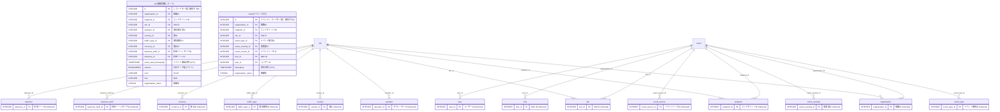

```mermaid

erDiagram
    %% -----------------------------------------------------------
    %% Fact Tables in lake__1nce_aws_s3__prod [1, 2]
    %% -----------------------------------------------------------
    
    "cdr(接続詳細レコード)" {
        INTEGER id PK "レコードを一意に識別するID"
        INTEGER organisation_id FK "組織ID"
        INTEGER endpoint_id FK "エンドポイントID"
        INTEGER sim_id FK "SIM ID"
        INTEGER operator_id FK "通信事業者ID"
        INTEGER country_id FK "国ID"
        INTEGER traffic_type_id FK "通信種別ID"
        INTEGER currency_id FK "通貨ID"
        INTEGER ratezone_tariff_id FK "料金ゾーンタリフID"
        INTEGER ratezone_id FK "料金ゾーンID"
        TIMESTAMP event_start_timestamp "イベント開始日時 (UTC)"
        BIGNUMERIC volume "合計データ量 (バイト)"
        INTEGER iccid "ICCID"
        INTEGER imsi "IMSI"
        STRING organisation_name "組織名"
    }

    "event(イベントログ)" {
        INTEGER id PK "イベントレコードを一意に識別するID"
        INTEGER organisation_id FK "組織ID"
        INTEGER endpoint_id FK "エンドポイントID"
        INTEGER sim_id FK "SIM ID"
        INTEGER event_type_id FK "イベント種別ID"
        INTEGER event_severity_id FK "重要度ID"
        INTEGER event_source_id FK "イベントソースID"
        INTEGER imsi_id FK "IMSI ID"
        INTEGER user_id FK "ユーザーID"
        TIMESTAMP timestamp "発生日時 (UTC)"
        STRING organisation_name "組織名"
    }

    %% -----------------------------------------------------------
    %% Inferred Dimension Tables (Based on FK names in cdr/event)
    %% Note: These tables are inferred as master/lookup tables for the FKs.
    %% -----------------------------------------------------------
    
    organisation {
        INTEGER organisation_id PK "組織ID (Inferred)"
    }

    endpoint {
        INTEGER endpoint_id PK "エンドポイントID (Inferred)"
    }

    sim {
        INTEGER sim_id PK "SIM ID (Inferred)"
    }
    
    user {
        INTEGER user_id PK "ユーザーID (Inferred)"
    }

    operator {
        INTEGER operator_id PK "オペレーターID (Inferred)"
    }

    country {
        INTEGER country_id PK "国ID (Inferred)"
    }
    
    traffic_type {
        INTEGER traffic_type_id PK "通信種別ID (Inferred)"
    }
    
    currency {
        INTEGER currency_id PK "通貨ID (Inferred)"
    }
    
    ratezone_tariff {
        INTEGER ratezone_tariff_id PK "料金ゾーンタリフID (Inferred)"
    }
    
    ratezone {
        INTEGER ratezone_id PK "料金ゾーンID (Inferred)"
    }

    event_type {
        INTEGER event_type_id PK "イベント種別ID (Inferred)"
    }

    event_severity {
        INTEGER event_severity_id PK "重要度ID (Inferred)"
    }

    event_source {
        INTEGER event_source_id PK "イベントソースID (Inferred)"
    }
    
    imsi {
        INTEGER imsi_id PK "IMSI ID (Inferred)"
    }


    %% -----------------------------------------------------------
    %% Relationships: Fact (Many) -> Dimension (One)
    %% The cardinalities are based on the FK structure found in cdr/event.
    %% -----------------------------------------------------------

    cdr ||--o{ organisation : organisation_id 
    cdr ||--o{ endpoint : endpoint_id
    cdr ||--o{ sim : sim_id 
    cdr ||--o{ operator : operator_id
    cdr ||--o{ country : country_id
    cdr ||--o{ traffic_type : traffic_type_id
    cdr ||--o{ currency : currency_id
    cdr ||--o{ ratezone_tariff : ratezone_tariff_id
    cdr ||--o{ ratezone : ratezone_id

    event ||--o{ organisation : organisation_id 
    event ||--o{ endpoint : endpoint_id
    event ||--o{ sim : sim_id 
    event ||--o{ event_type : event_type_id
    event ||--o{ event_severity : event_severity_id
    event ||--o{ event_source : event_source_id
    event ||--o{ imsi : imsi_id
    event ||--o{ user : user_id

```