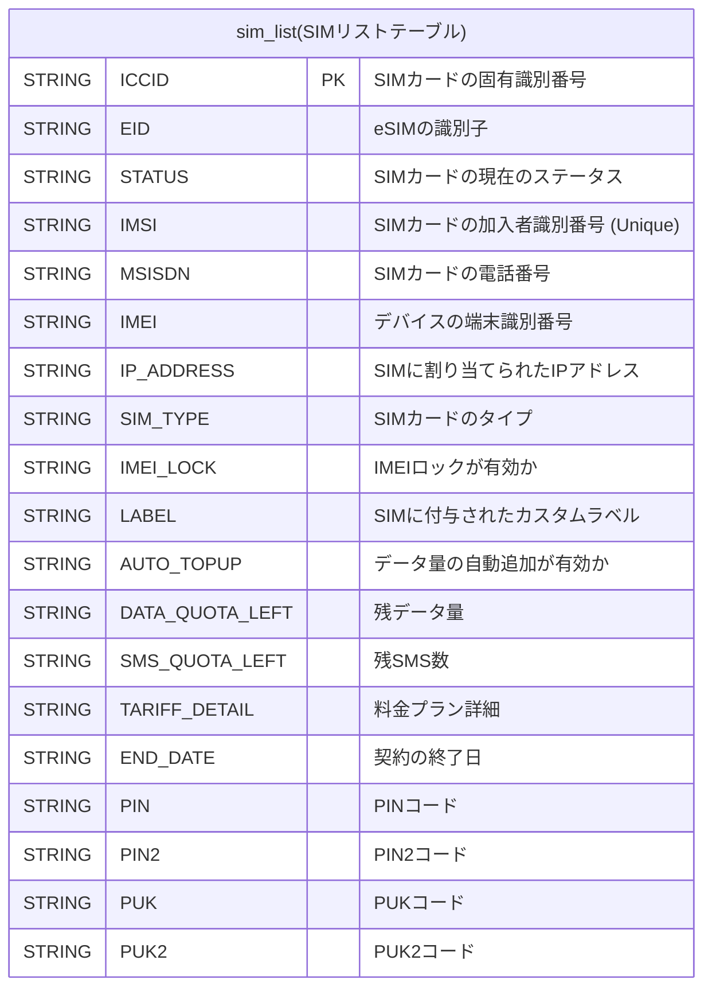

```mermaid
erDiagram
    %% =======================================================
    %% lake__1nce_gcs__prod Schema Analysis
    %% NOTE: Only one non-template table (sim_list) exists.
    %% =======================================================
    
    "sim_list(SIMリストテーブル)" {
        STRING ICCID PK "SIMカードの固有識別番号"
        STRING EID "eSIMの識別子"
        STRING STATUS "SIMカードの現在のステータス"
        STRING IMSI "SIMカードの加入者識別番号 (Unique)"
        STRING MSISDN "SIMカードの電話番号"
        STRING IMEI "デバイスの端末識別番号"
        STRING IP_ADDRESS "SIMに割り当てられたIPアドレス"
        STRING SIM_TYPE "SIMカードのタイプ"
        STRING IMEI_LOCK "IMEIロックが有効か"
        STRING LABEL "SIMに付与されたカスタムラベル"
        STRING AUTO_TOPUP "データ量の自動追加が有効か"
        STRING DATA_QUOTA_LEFT "残データ量"
        STRING SMS_QUOTA_LEFT "残SMS数"
        STRING TARIFF_DETAIL "料金プラン詳細"
        STRING END_DATE "契約の終了日"
        STRING PIN "PINコード"
        STRING PIN2 "PIN2コード"
        STRING PUK "PUKコード"
        STRING PUK2 "PUK2コード"
    }
```