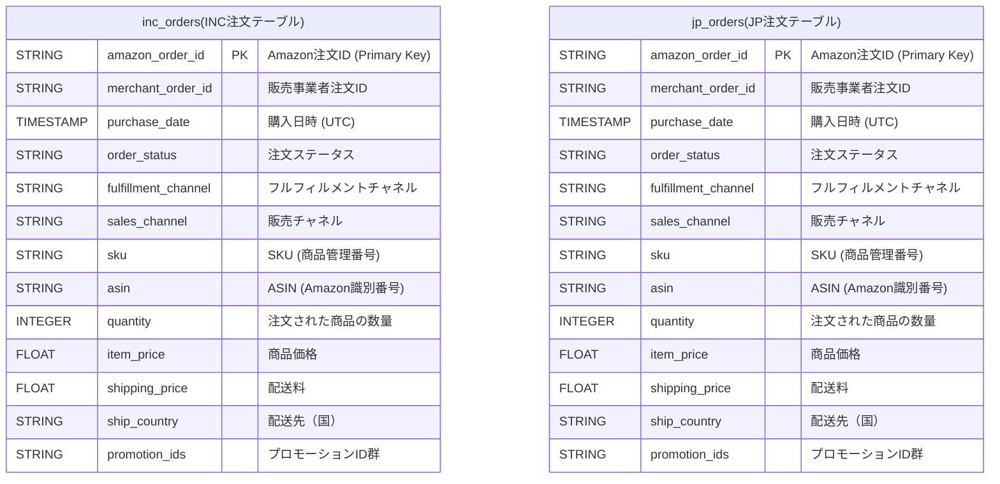

```mermaid
erDiagram
    %% =======================================================
    %% lake__amazon_sp_api__prod Schema Analysis
    %% NOTE: inc_orders and jp_orders are parallel transaction tables.
    %% =======================================================
    
    "inc_orders(INC注文テーブル)" {
        STRING amazon_order_id PK "Amazon注文ID (Primary Key)"
        STRING merchant_order_id "販売事業者注文ID"
        TIMESTAMP purchase_date "購入日時 (UTC)"
        STRING order_status "注文ステータス"
        STRING fulfillment_channel "フルフィルメントチャネル"
        STRING sales_channel "販売チャネル"
        STRING sku "SKU (商品管理番号)"
        STRING asin "ASIN (Amazon識別番号)"
        INTEGER quantity "注文された商品の数量"
        FLOAT item_price "商品価格"
        FLOAT shipping_price "配送料"
        STRING ship_country "配送先（国）"
        STRING promotion_ids "プロモーションID群"
    }
    
    "jp_orders(JP注文テーブル)" {
        STRING amazon_order_id PK "Amazon注文ID (Primary Key)"
        STRING merchant_order_id "販売事業者注文ID"
        TIMESTAMP purchase_date "購入日時 (UTC)"
        STRING order_status "注文ステータス"
        STRING fulfillment_channel "フルフィルメントチャネル"
        STRING sales_channel "販売チャネル"
        STRING sku "SKU (商品管理番号)"
        STRING asin "ASIN (Amazon識別番号)"
        INTEGER quantity "注文された商品の数量"
        FLOAT item_price "商品価格"
        FLOAT shipping_price "配送料"
        STRING ship_country "配送先（国）"
        STRING promotion_ids "プロモーションID群"
    }
```