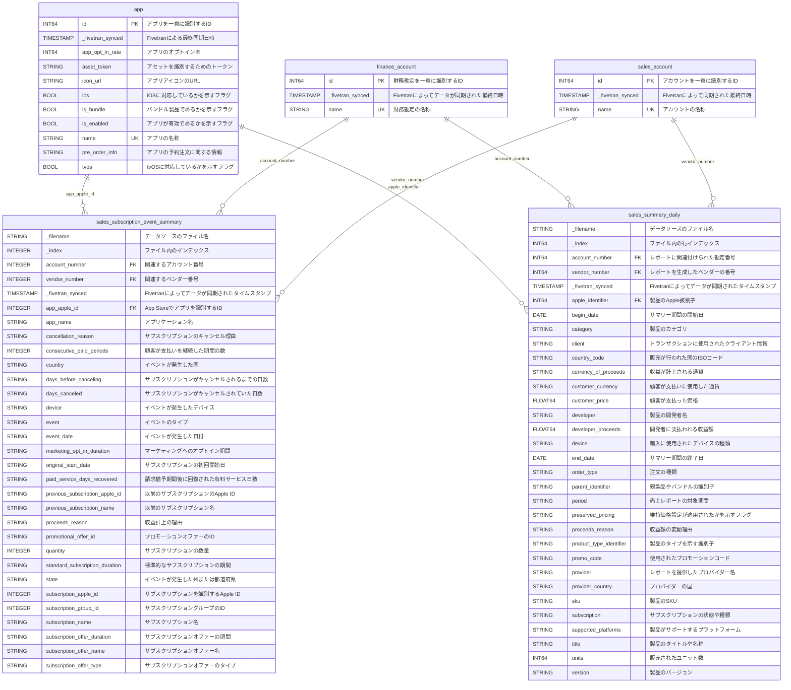

```mermaid
erDiagram
    %% =======================================================
    %% lake__apple_store_connect__prod Schema
    %% =======================================================
    
    app {
        INT64 id PK "アプリを一意に識別するID"
        TIMESTAMP _fivetran_synced "Fivetranによる最終同期日時"
        INT64 app_opt_in_rate "アプリのオプトイン率"
        STRING asset_token "アセットを識別するためのトークン"
        STRING icon_url "アプリアイコンのURL"
        BOOL ios "iOSに対応しているかを示すフラグ"
        BOOL is_bundle "バンドル製品であるかを示すフラグ"
        BOOL is_enabled "アプリが有効であるかを示すフラグ"
        STRING name UK "アプリの名称"
        STRING pre_order_info "アプリの予約注文に関する情報"
        BOOL tvos "tvOSに対応しているかを示すフラグ"
    }
    
    finance_account {
        INT64 id PK "財務勘定を一意に識別するID"
        TIMESTAMP _fivetran_synced "Fivetranによってデータが同期された最終日時"
        STRING name UK "財務勘定の名称"
    }
    
    sales_account {
        INT64 id PK "アカウントを一意に識別するID"
        TIMESTAMP _fivetran_synced "Fivetranによって同期された最終日時"
        STRING name UK "アカウントの名称"
    }
    
    sales_subscription_event_summary {
        STRING _filename "データソースのファイル名"
        INTEGER _index "ファイル内のインデックス"
        INTEGER account_number FK "関連するアカウント番号"
        INTEGER vendor_number FK "関連するベンダー番号"
        TIMESTAMP _fivetran_synced "Fivetranによってデータが同期されたタイムスタンプ"
        INTEGER app_apple_id FK "App Storeでアプリを識別するID"
        STRING app_name "アプリケーション名"
        STRING cancellation_reason "サブスクリプションのキャンセル理由"
        INTEGER consecutive_paid_periods "顧客が支払いを継続した期間の数"
        STRING country "イベントが発生した国"
        STRING days_before_canceling "サブスクリプションがキャンセルされるまでの日数"
        STRING days_canceled "サブスクリプションがキャンセルされていた日数"
        STRING device "イベントが発生したデバイス"
        STRING event "イベントのタイプ"
        STRING event_date "イベントが発生した日付"
        STRING marketing_opt_in_duration "マーケティングへのオプトイン期間"
        STRING original_start_date "サブスクリプションの初回開始日"
        STRING paid_service_days_recovered "請求猶予期間後に回復された有料サービス日数"
        STRING previous_subscription_apple_id "以前のサブスクリプションのApple ID"
        STRING previous_subscription_name "以前のサブスクリプション名"
        STRING proceeds_reason "収益計上の理由"
        STRING promotional_offer_id "プロモーションオファーのID"
        INTEGER quantity "サブスクリプションの数量"
        STRING standard_subscription_duration "標準的なサブスクリプションの期間"
        STRING state "イベントが発生した州または都道府県"
        INTEGER subscription_apple_id "サブスクリプションを識別するApple ID"
        INTEGER subscription_group_id "サブスクリプショングループのID"
        STRING subscription_name "サブスクリプション名"
        STRING subscription_offer_duration "サブスクリプションオファーの期間"
        STRING subscription_offer_name "サブスクリプションオファー名"
        STRING subscription_offer_type "サブスクリプションオファーのタイプ"
    }
    
    sales_summary_daily {
        STRING _filename "データソースのファイル名"
        INT64 _index "ファイル内の行インデックス"
        INT64 account_number FK "レポートに関連付けられた勘定番号"
        INT64 vendor_number FK "レポートを生成したベンダーの番号"
        TIMESTAMP _fivetran_synced "Fivetranによってデータが同期されたタイムスタンプ"
        INT64 apple_identifier FK "製品のApple識別子"
        DATE begin_date "サマリー期間の開始日"
        STRING category "製品のカテゴリ"
        STRING client "トランザクションに使用されたクライアント情報"
        STRING country_code "販売が行われた国のISOコード"
        STRING currency_of_proceeds "収益が計上される通貨"
        STRING customer_currency "顧客が支払いに使用した通貨"
        FLOAT64 customer_price "顧客が支払った価格"
        STRING developer "製品の開発者名"
        FLOAT64 developer_proceeds "開発者に支払われる収益額"
        STRING device "購入に使用されたデバイスの種類"
        DATE end_date "サマリー期間の終了日"
        STRING order_type "注文の種類"
        STRING parent_identifier "親製品やバンドルの識別子"
        STRING period "売上レポートの対象期間"
        STRING preserved_pricing "維持価格設定が適用されたかを示すフラグ"
        STRING proceeds_reason "収益額の変動理由"
        STRING product_type_identifier "製品のタイプを示す識別子"
        STRING promo_code "使用されたプロモーションコード"
        STRING provider "レポートを提供したプロバイダー名"
        STRING provider_country "プロバイダーの国"
        STRING sku "製品のSKU"
        STRING subscription "サブスクリプションの状態や種類"
        STRING supported_platforms "製品がサポートするプラットフォーム"
        STRING title "製品のタイトルや名称"
        INT64 units "販売されたユニット数"
        STRING version "製品のバージョン"
    }

    %% -----------------------------------------------------------
    %% Relationships (Inferred)
    %% -----------------------------------------------------------

    app ||--o{ sales_subscription_event_summary : app_apple_id
    app ||--o{ sales_summary_daily : apple_identifier
    
    finance_account ||--o{ sales_subscription_event_summary : account_number
    finance_account ||--o{ sales_summary_daily : account_number
    
    sales_account ||--o{ sales_subscription_event_summary : vendor_number
    sales_account ||--o{ sales_summary_daily : vendor_number
```