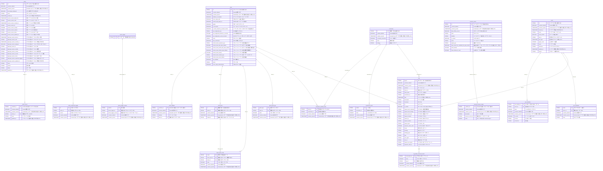

```mermaid
erDiagram
    %% =======================================================
    %% Master / Dimension Tables
    %% =======================================================
    
    action {
        STRING id PK "アクションを一意に識別するID"
        BOOLEAN _fivetran_deleted "Fivetran削除フラグ"
        TIMESTAMP _fivetran_synced "Fivetranによってデータが最後に同期された日時 (UTC)"
        BOOLEAN all_changes_deployed "全ての変更がデプロイ済みか"
        STRING code "アクションのソースコード"
        TIMESTAMP created_at "アクションが作成された日時 (UTC)"
        TIMESTAMP current_version_build_time "現行バージョンのビルド日時"
        STRING current_version_code "現行バージョンのソースコード"
        TIMESTAMP current_version_created_at "現行バージョンが作成された日時"
        STRING current_version_id "現行バージョンのID"
        INTEGER current_version_number "現行バージョンの番号"
        STRING current_version_runtime "現行バージョンの実行環境"
        STRING current_version_status "現行バージョンのステータス"
        TIMESTAMP current_version_updated_at "現行バージョンが更新された日時"
        TIMESTAMP deployed_version_built_at "デプロイ済みバージョンのビルド日時"
        STRING deployed_version_code "デプロイ済みバージョンのソースコード"
        TIMESTAMP deployed_version_created_at "デプロイ済みバージョンが作成された日時"
        BOOLEAN deployed_version_deployed "デプロイ済みバージョンがデプロイされているか"
        STRING deployed_version_id "デプロイ済みバージョンのID"
        INTEGER deployed_version_number "デプロイ済みバージョンの番号"
        STRING deployed_version_runtime "デプロイ済みバージョンの実行環境"
        STRING deployed_version_secrets "デプロイ済みバージョンのシークレット情報"
        STRING deployed_version_status "デプロイ済みバージョンのステータス"
        STRING deployed_version_supported_triggers "デプロイ済みバージョンが対応するトリガー"
        TIMESTAMP deployed_version_updated_at "デプロイ済みバージョンが更新された日時"
        STRING name "アクションの名称"
        STRING runtime "実行環境"
        STRING status "ステータス"
        TIMESTAMP updated_at "アクションが最後に更新された日時 (UTC)"
    }
    
    action_trigger {
        STRING id PK "トリガーを一意に識別するID (Inferred)"
    }

    client {
        STRING id PK "クライアントを一意に識別するID"
        BOOLEAN _fivetran_deleted "Fivetran削除フラグ"
        TIMESTAMP _fivetran_synced "Fivetranによってデータが最後に同期された日時 (UTC)"
        BOOLEAN callback_url_template "コールバックURLテンプレートフラグ"
        BOOLEAN cross_origin_auth "クロスオリジン認証が有効か"
        BOOLEAN custom_login_page_on "カスタムログインページが有効か"
        BOOLEAN global "グローバルクライアントか"
        BOOLEAN is_first_party "ファーストパーティクライアントか"
        BOOLEAN is_token_endpoint_ip_header_trusted "トークンエンドポイントのIPヘッダーを信頼するか"
        STRING jwt_configuration_alg "JWT署名アルゴリズム"
        INTEGER jwt_configuration_lifetime_in_seconds "JWTの有効期間（秒）"
        BOOLEAN jwt_configuration_secret_encoded "JWTのシークレットがエンコードされているか"
        STRING name "クライアントの名称"
        BOOLEAN oidc_conformant "OIDCに準拠しているか"
        STRING refresh_token_expiration_type "リフレッシュトークンの有効期限タイプ"
        INTEGER refresh_token_idle_token_lifetime "リフレッシュトークンのアイドル有効期間"
        BOOLEAN refresh_token_infinite_idle_token_lifetime "リフレッシュトークンのアイドル有効期間が無制限か"
        BOOLEAN refresh_token_infinite_token_lifetime "リフレッシュトークンの有効期間が無制限か"
        INTEGER refresh_token_leeway "リフレッシュトークンの猶予期間"
        STRING refresh_token_rotation_type "リフレッシュトークンのローテーションタイプ"
        INTEGER refresh_token_token_lifetime "リフレッシュトークンの有効期間"
        BOOLEAN sso_disabled "SSOが無効か"
        STRING tenant "テナント名"
        BOOLEAN cross_origin_authentication "クロスオリジン認証"
    }
    
    connection {
        STRING id PK "接続を一意に識別するID"
        BOOLEAN _fivetran_deleted "Fivetran削除フラグ"
        TIMESTAMP _fivetran_synced "Fivetranによってデータが最後に同期された日時 (UTC)"
        BOOLEAN is_domain_connection "ドメイン接続か"
        STRING name "接続の名称"
        STRING strategy "認証ストラテジー"
    }
    
    resource_server {
        STRING id PK "リソースサーバーを一意に識別するID"
        BOOLEAN _fivetran_deleted "Fivetran削除フラグ"
        TIMESTAMP _fivetran_synced "Fivetranによってデータが最後に同期された日時 (UTC)"
        BOOLEAN allow_offline_access "オフラインアクセスを許可するか"
        STRING client "クライアント"
        STRING identifier "リソースサーバーの識別子（オーディエンス）"
        BOOLEAN is_system "システムAPIか"
        STRING name "リソースサーバーの名称"
        STRING signing_alg "署名アルゴリズム"
        BOOLEAN skip_consent_for_verifiable_first_party_clients "検証可能なファーストパーティクライアントの同意をスキップするか"
        INTEGER token_lifetime "トークンの有効期間"
        INTEGER token_lifetime_for_web "Web用のトークンの有効期間"
    }

    users {
        STRING id PK "ユーザーを一意に識別するID"
        BOOLEAN _fivetran_deleted "Fivetran削除フラグ"
        TIMESTAMP _fivetran_synced "Fivetranによってデータが最後に同期された日時 (UTC)"
        TIMESTAMP created_at "ユーザーが作成された日時 (UTC)"
        STRING email "ユーザーのEメールアドレス"
        BOOLEAN email_verified "Eメールが検証済みか"
        STRING last_ip "最後にログインしたIPアドレス"
        TIMESTAMP last_login "最後にログインした日時 (UTC)"
        INTEGER logins_count "合計ログイン回数"
        STRING name "ユーザーの氏名"
        STRING nickname "ユーザーのニックネーム"
        TIMESTAMP updated_at "ユーザーが最後に更新された日時 (UTC)"
        STRING picture "プロフィール画像のURL"
    }

    %% =======================================================
    %% Relationship / Detail / Log Tables
    %% =======================================================

    action_secret {
        STRING _fivetran_id PK "Fivetranが生成したレコードの一意なID"
        BOOLEAN _fivetran_deleted "Fivetran削除フラグ"
        TIMESTAMP _fivetran_synced "Fivetranによってデータが最後に同期された日時 (UTC)"
        STRING action_id FK "関連するアクションのID"
        STRING name "シークレットの名称"
        TIMESTAMP updated_at "シークレットが最後に更新された日時 (UTC)"
    }

    action_supported_trigger {
        STRING id PK "対応トリガーのID"
        STRING action_id FK "関連するアクションのID"
        STRING version "対応トリガーのバージョン"
        BOOLEAN _fivetran_deleted "Fivetran削除フラグ"
        TIMESTAMP _fivetran_synced "Fivetranによってデータが最後に同期された日時 (UTC)"
    }
    
    action_trigger_runtime {
        STRING runtime PK "実行環境"
        STRING action_trigger_id FK "関連するアクショントリガーのID"
        STRING action_trigger_version "関連するアクショントリガーのバージョン"
        BOOLEAN _fivetran_deleted "Fivetran削除フラグ"
        TIMESTAMP _fivetran_synced "Fivetranによってデータが最後に同期された日時 (UTC)"
    }

    client_callback {
        STRING _fivetran_id PK "Fivetranが生成したレコードの一意なID"
        BOOLEAN _fivetran_deleted "Fivetran削除フラグ"
        TIMESTAMP _fivetran_synced "Fivetranによってデータが最後に同期された日時 (UTC)"
        STRING callback "コールバックURL"
        STRING client_id FK "関連するクライアントのID"
    }

    client_grant {
        STRING id PK "権限付与を一意に識別するID"
        STRING client_id FK "権限を要求するクライアントのID"
        BOOLEAN _fivetran_deleted "Fivetran削除フラグ"
        TIMESTAMP _fivetran_synced "Fivetranによってデータが最後に同期された日時 (UTC)"
        STRING audience "権限の対象となるAPI（オーディエンス）"
    }

    client_grant_scope {
        STRING scope PK "要求された権限スコープ"
        STRING client_grant_id FK "関連するクライアント権限付与のID"
        STRING client_id FK "関連するクライアントのID"
        INTEGER index "リスト内のインデックス"
        BOOLEAN _fivetran_deleted "Fivetran削除フラグ"
        TIMESTAMP _fivetran_synced "Fivetranによってデータが最後に同期された日時 (UTC)"
    }
    
    client_grant_type {
        STRING grant_type PK "認可グラントタイプ"
        STRING client_id FK "関連するクライアントのID"
        INTEGER index "リスト内のインデックス"
        BOOLEAN _fivetran_deleted "Fivetran削除フラグ"
        TIMESTAMP _fivetran_synced "Fivetranによってデータが最後に同期された日時 (UTC)"
    }

    connection_enabled_client {
        STRING client_id FK "関連するクライアントのID"
        STRING connection_id FK "関連する接続のID"
        BOOLEAN _fivetran_deleted "Fivetran削除フラグ"
        TIMESTAMP _fivetran_synced "Fivetranによってデータが最後に同期された日時 (UTC)"
    }

    connection_realm {
        STRING realms PK "レルム名"
        STRING connection_id FK "関連する接続のID"
        INTEGER index "リスト内のインデックス"
        BOOLEAN _fivetran_deleted "Fivetran削除フラグ"
        TIMESTAMP _fivetran_synced "Fivetranによってデータが最後に同期された日時 (UTC)"
    }
    
    logs {
        STRING log_id PK "ログエントリを一意に識別するID"
        BOOLEAN _fivetran_deleted "Fivetran削除フラグ"
        TIMESTAMP _fivetran_synced "Fivetranによってデータが最後に同期された日時 (UTC)"
        STRING audience "オーディエンス"
        STRING client_id FK "関連するクライアントのID"
        STRING client_name "クライアントの名称"
        STRING connection_id FK "関連する接続のID"
        TIMESTAMP date "イベントが発生した日時 (UTC)"
        STRING description "イベントの説明"
        STRING hostname "ホスト名"
        STRING ip "IPアドレス"
        BOOLEAN is_mobile "モバイルデバイスからのアクセスか"
        STRING request_auth_credential "リクエストの認証資格情報"
        STRING request_auth_strategy "リクエストの認証ストラテジー"
        STRING request_auth_user "リクエストの認証ユーザー"
        STRING request_channel "リクエストチャネル"
        STRING request_ip "リクエスト元のIPアドレス"
        STRING request_method "リクエストメソッド"
        STRING request_path "リクエストパス"
        INTEGER response_status_code "レスポンスのステータスコード"
        STRING scope "要求されたスコープ"
        STRING strategy "認証ストラテジー"
        STRING strategy_type "認証ストラテジーのタイプ"
        STRING type "ログイベントのタイプ"
        STRING user_agent "ユーザーエージェント"
        STRING user_id FK "関連するユーザーのID"
        STRING request_user_agent "リクエストのユーザーエージェント"
        STRING response_client_id "レスポンスのクライアントID"
    }

    log_detail_accessed_secret {
        STRING accessedsecret PK "アクセスされたシークレット"
        INTEGER index "リスト内のインデックス"
        STRING log_id FK "関連するログのID"
        BOOLEAN _fivetran_deleted "Fivetran削除フラグ"
        TIMESTAMP _fivetran_synced "Fivetranによってデータが最後に同期された日時 (UTC)"
    }

    resource_server_scopes {
        STRING _fivetran_id PK "Fivetranが生成したレコードの一意なID"
        BOOLEAN _fivetran_deleted "Fivetran削除フラグ"
        TIMESTAMP _fivetran_synced "Fivetranによってデータが最後に同期された日時 (UTC)"
        STRING description "スコープの説明"
        STRING resource_server_id FK "関連するリソースサーバーのID"
        STRING value "スコープの値（例: read:messages）"
    }
    
    user_identities {
        STRING user_identity_id PK "IDプロバイダにおけるユーザーID"
        STRING users_id FK "関連するユーザーのID"
        INTEGER index "リスト内のインデックス"
        BOOLEAN _fivetran_deleted "Fivetran削除フラグ"
        TIMESTAMP _fivetran_synced "Fivetranによってデータが最後に同期された日時 (UTC)"
        BOOLEAN is_social "ソーシャルログインか"
        STRING provider "IDプロバイダ名"
        STRING connection "接続名"
    }
    
    user_metadata {
        STRING name PK "メタデータのキー（名称）"
        STRING users_id FK "関連するユーザーのID"
        BOOLEAN _fivetran_deleted "Fivetran削除フラグ"
        TIMESTAMP _fivetran_synced "Fivetranによってデータが最後に同期された日時 (UTC)"
        STRING value "メタデータの値"
    }

    %% =======================================================
    %% Relationships
    %% =======================================================
    
    %% Action Management
    action ||--o{ action_secret : action_id
    action ||--o{ action_supported_trigger : action_id
    action_trigger ||--o{ action_trigger_runtime : action_trigger_id

    %% Client Management
    client ||--o{ client_callback : client_id
    client ||--o{ client_grant : client_id
    client ||--o{ client_grant_scope : client_id
    client ||--o{ client_grant_type : client_id
    client_grant ||--o{ client_grant_scope : client_grant_id

    %% Connection Management
    connection ||--o{ connection_enabled_client : connection_id
    connection ||--o{ connection_realm : connection_id
    client ||--o{ connection_enabled_client : client_id

    %% API / Resource Server Management
    resource_server ||--o{ resource_server_scopes : resource_server_id

    %% User Management
    users ||--o{ user_identities : users_id
    users ||--o{ user_metadata : users_id
    users ||--o{ logs : user_id

    %% Logging / Auditing
    logs ||--o{ log_detail_accessed_secret : log_id
    client ||--o{ logs : client_id
    connection ||--o{ logs : connection_id
```