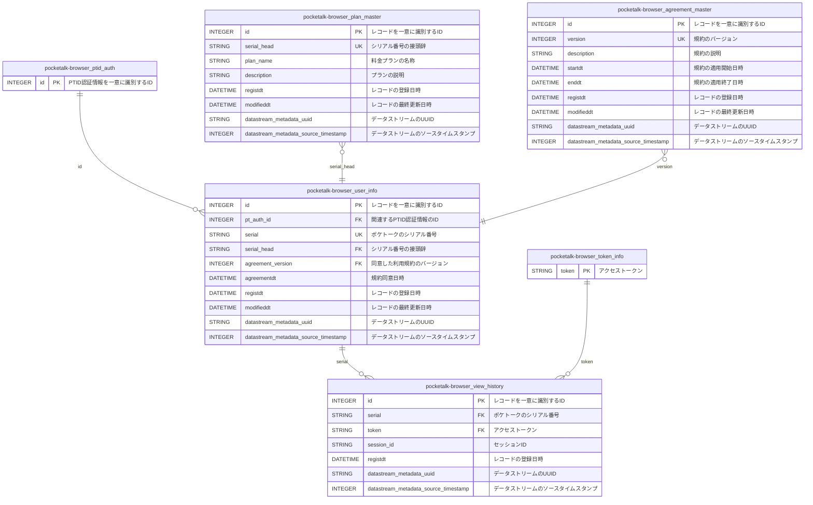

```mermaid
erDiagram
    %% =======================================================
    %% lake__browser_prod_db_sql Schema
    %% =======================================================
    
    "pocketalk-browser_agreement_master" {
        INTEGER id PK "レコードを一意に識別するID"
        INTEGER version UK "規約のバージョン"
        STRING description "規約の説明"
        DATETIME startdt "規約の適用開始日時"
        DATETIME enddt "規約の適用終了日時"
        DATETIME registdt "レコードの登録日時"
        DATETIME modifieddt "レコードの最終更新日時"
        STRING datastream_metadata_uuid "データストリームのUUID"
        INTEGER datastream_metadata_source_timestamp "データストリームのソースタイムスタンプ"
    }
    
    "pocketalk-browser_plan_master" {
        INTEGER id PK "レコードを一意に識別するID"
        STRING serial_head UK "シリアル番号の接頭辞"
        STRING plan_name "料金プランの名称"
        STRING description "プランの説明"
        DATETIME registdt "レコードの登録日時"
        DATETIME modifieddt "レコードの最終更新日時"
        STRING datastream_metadata_uuid "データストリームのUUID"
        INTEGER datastream_metadata_source_timestamp "データストリームのソースタイムスタンプ"
    }
    
    "pocketalk-browser_ptid_auth" {
        INTEGER id PK "PTID認証情報を一意に識別するID"
        %% 詳細カラムはソースにないため省略
    }
    
    "pocketalk-browser_token_info" {
        STRING token PK "アクセストークン"
        %% 詳細カラムはソースにないため省略
    }

    "pocketalk-browser_user_info" {
        INTEGER id PK "レコードを一意に識別するID"
        INTEGER pt_auth_id FK "関連するPTID認証情報のID"
        STRING serial UK "ポケトークのシリアル番号"
        STRING serial_head FK "シリアル番号の接頭辞"
        INTEGER agreement_version FK "同意した利用規約のバージョン"
        DATETIME agreementdt "規約同意日時"
        DATETIME registdt "レコードの登録日時"
        DATETIME modifieddt "レコードの最終更新日時"
        STRING datastream_metadata_uuid "データストリームのUUID"
        INTEGER datastream_metadata_source_timestamp "データストリームのソースタイムスタンプ"
    }
    
    "pocketalk-browser_view_history" {
        INTEGER id PK "レコードを一意に識別するID"
        STRING serial FK "ポケトークのシリアル番号"
        STRING token FK "アクセストークン"
        STRING session_id "セッションID"
        DATETIME registdt "レコードの登録日時"
        STRING datastream_metadata_uuid "データストリームのUUID"
        INTEGER datastream_metadata_source_timestamp "データストリームのソースタイムスタンプ"
    }

    %% -----------------------------------------------------------
    %% Relationships
    %% -----------------------------------------------------------
    
    "pocketalk-browser_ptid_auth" ||--o{ "pocketalk-browser_user_info" : id
    "pocketalk-browser_plan_master" }o--|| "pocketalk-browser_user_info" : serial_head
    "pocketalk-browser_agreement_master" }o--|| "pocketalk-browser_user_info" : version
    "pocketalk-browser_user_info" ||--o{ "pocketalk-browser_view_history" : serial
    "pocketalk-browser_token_info" ||--o{ "pocketalk-browser_view_history" : token
```