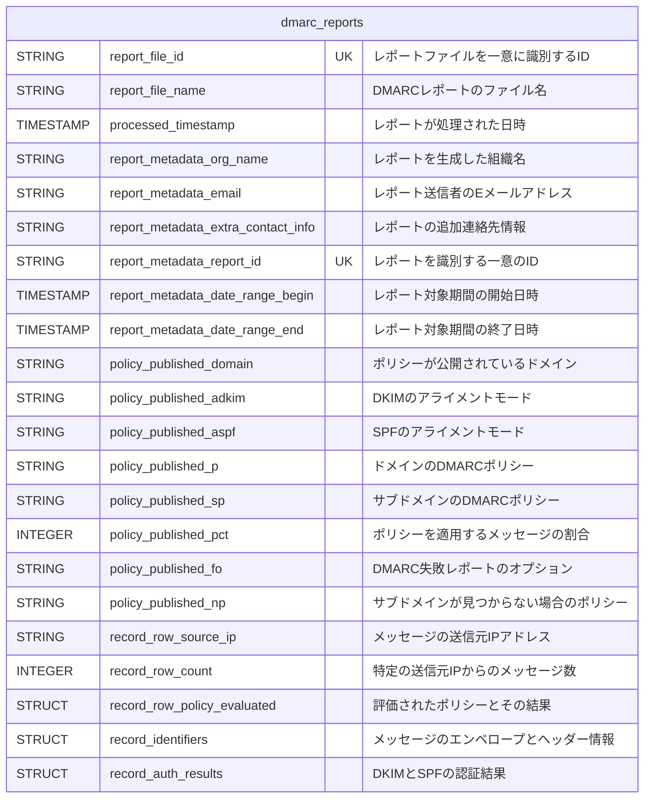

```mermaid
erDiagram
    %% =======================================================
    %% lake__dmarc_report__prod Schema Analysis
    %% NOTE: Only one non-template table (dmarc_reports) exists.
    %% =======================================================
    
    dmarc_reports {
        STRING report_file_id UK "レポートファイルを一意に識別するID"
        STRING report_file_name "DMARCレポートのファイル名"
        TIMESTAMP processed_timestamp "レポートが処理された日時"
        STRING report_metadata_org_name "レポートを生成した組織名"
        STRING report_metadata_email "レポート送信者のEメールアドレス"
        STRING report_metadata_extra_contact_info "レポートの追加連絡先情報"
        STRING report_metadata_report_id UK "レポートを識別する一意のID"
        TIMESTAMP report_metadata_date_range_begin "レポート対象期間の開始日時"
        TIMESTAMP report_metadata_date_range_end "レポート対象期間の終了日時"
        STRING policy_published_domain "ポリシーが公開されているドメイン"
        STRING policy_published_adkim "DKIMのアライメントモード"
        STRING policy_published_aspf "SPFのアライメントモード"
        STRING policy_published_p "ドメインのDMARCポリシー"
        STRING policy_published_sp "サブドメインのDMARCポリシー"
        INTEGER policy_published_pct "ポリシーを適用するメッセージの割合"
        STRING policy_published_fo "DMARC失敗レポートのオプション"
        STRING policy_published_np "サブドメインが見つからない場合のポリシー"
        STRING record_row_source_ip "メッセージの送信元IPアドレス"
        INTEGER record_row_count "特定の送信元IPからのメッセージ数"
        STRUCT record_row_policy_evaluated "評価されたポリシーとその結果"
        STRUCT record_identifiers "メッセージのエンベロープとヘッダー情報"
        STRUCT record_auth_results "DKIMとSPFの認証結果"
    }
    
    %% -----------------------------------------------------------
    %% Relationships (None inferred within this schema)
    %% -----------------------------------------------------------
```