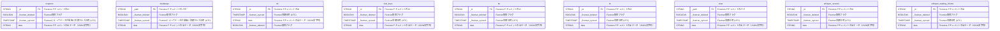

```mermaid
erDiagram
    %% =======================================================
    %% lake__engine_server__prod Schema (Firestore Collections)
    %% All tables are independent collections lacking explicit foreign keys in defined columns.
    %% =======================================================
    
    coupons {
        STRING _id PK "FirestoreドキュメントのID"
        BOOLEAN _fivetran_deleted "Fivetran削除フラグ"
        TIMESTAMP _fivetran_synced "Fivetranによってデータが最後に同期された日時 (UTC)"
        STRING data "Firestoreドキュメントの全データ（JSON文字列）"
    }
    
    destlangs {
        STRING _path PK "Firestoreドキュメントのパス"
        BOOLEAN _fivetran_deleted "Fivetran削除フラグ"
        TIMESTAMP _fivetran_synced "Fivetranによってデータが最後に同期された日時 (UTC)"
        STRING data "Firestoreドキュメントの全データ（JSON文字列）"
    }
    
    stt {
        STRING _id PK "FirestoreドキュメントのID"
        TIMESTAMP _fivetran_synced "Fivetran同期日時 (UTC)"
        STRING data "Firestoreドキュメントの全データ（JSON文字列）"
        BOOLEAN _fivetran_deleted "Fivetran削除フラグ"
    }
    
    trial_keys {
        STRING _id PK "FirestoreドキュメントのID"
        BOOLEAN _fivetran_deleted "Fivetran削除フラグ"
        TIMESTAMP _fivetran_synced "Fivetran同期日時 (UTC)"
        STRING data "Firestoreドキュメントの全データ（JSON文字列）"
    }
    
    tts {
        STRING _id PK "FirestoreドキュメントのID"
        BOOLEAN _fivetran_deleted "Fivetran削除フラグ"
        TIMESTAMP _fivetran_synced "Fivetran同期日時 (UTC)"
        STRING data "Firestoreドキュメントの全データ（JSON文字列）"
    }
    
    ttt {
        STRING _id PK "FirestoreドキュメントのID"
        BOOLEAN _fivetran_deleted "Fivetran削除フラグ"
        TIMESTAMP _fivetran_synced "Fivetran同期日時 (UTC)"
        STRING data "Firestoreドキュメントの全データ（JSON文字列）"
    }
    
    view {
        STRING _path PK "Firestoreドキュメントのパス"
        BOOLEAN _fivetran_deleted "Fivetran削除フラグ"
        TIMESTAMP _fivetran_synced "Fivetran同期日時 (UTC)"
        STRING data "Firestoreドキュメントの全データ（JSON文字列）"
    }
    
    whisper_servers {
        STRING _id PK "FirestoreドキュメントのID"
        BOOLEAN _fivetran_deleted "Fivetran削除フラグ"
        TIMESTAMP _fivetran_synced "Fivetran同期日時 (UTC)"
        STRING data "Firestoreドキュメントの全データ（JSON文字列）"
    }
    
    whisper_waiting_clients {
        STRING _id PK "FirestoreドキュメントのID"
        BOOLEAN _fivetran_deleted "Fivetran削除フラグ"
        TIMESTAMP _fivetran_synced "Fivetran同期日時 (UTC)"
        STRING data "Firestoreドキュメントの全データ（JSON文字列）"
    }

    %% -----------------------------------------------------------
    %% Relationships (None inferred based on defined columns)
    %% -----------------------------------------------------------
```