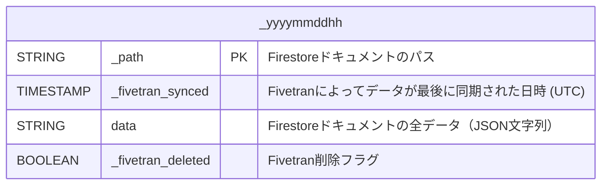

```mermaid
erDiagram
    %% =======================================================
    %% lake__engine_server_crown__prod Schema Analysis
    %% NOTE: Only one non-template table exists, so no relationships can be inferred.
    %% =======================================================
    
    "_yyyymmddhh" {
        STRING _path PK "Firestoreドキュメントのパス"
        TIMESTAMP _fivetran_synced "Fivetranによってデータが最後に同期された日時 (UTC)"
        STRING data "Firestoreドキュメントの全データ（JSON文字列）"
        BOOLEAN _fivetran_deleted "Fivetran削除フラグ"
    }
    
    %% -----------------------------------------------------------
    %% Relationships (None inferred within this schema)
    %% -----------------------------------------------------------
```