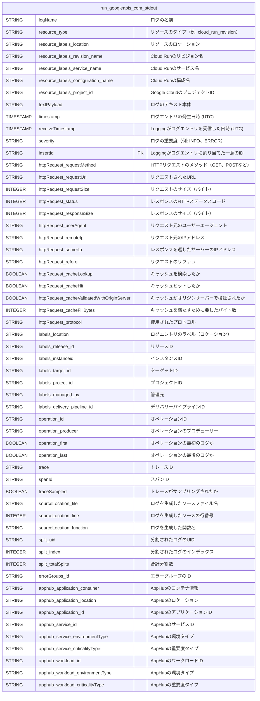

```mermaid
erDiagram
    %% =======================================================
    %% lake__engine_server_crown_gcp_log__prod Schema Analysis
    %% NOTE: Only one non-template table exists, so no relationships can be inferred.
    %% =======================================================
    
    run_googleapis_com_stdout {
        STRING logName "ログの名前"
        STRING resource_type "リソースのタイプ（例: cloud_run_revision）"
        STRING resource_labels_location "リソースのロケーション"
        STRING resource_labels_revision_name "Cloud Runのリビジョン名"
        STRING resource_labels_service_name "Cloud Runのサービス名"
        STRING resource_labels_configuration_name "Cloud Runの構成名"
        STRING resource_labels_project_id "Google CloudのプロジェクトID"
        STRING textPayload "ログのテキスト本体"
        TIMESTAMP timestamp "ログエントリの発生日時 (UTC)"
        TIMESTAMP receiveTimestamp "Loggingがログエントリを受信した日時 (UTC)"
        STRING severity "ログの重要度（例: INFO、ERROR）"
        STRING insertId PK "Loggingがログエントリに割り当てた一意のID"
        STRING httpRequest_requestMethod "HTTPリクエストのメソッド（GET、POSTなど）"
        STRING httpRequest_requestUrl "リクエストされたURL"
        INTEGER httpRequest_requestSize "リクエストのサイズ（バイト）"
        INTEGER httpRequest_status "レスポンスのHTTPステータスコード"
        INTEGER httpRequest_responseSize "レスポンスのサイズ（バイト）"
        STRING httpRequest_userAgent "リクエスト元のユーザーエージェント"
        STRING httpRequest_remoteIp "リクエスト元のIPアドレス"
        STRING httpRequest_serverIp "レスポンスを返したサーバーのIPアドレス"
        STRING httpRequest_referer "リクエストのリファラ"
        BOOLEAN httpRequest_cacheLookup "キャッシュを検索したか"
        BOOLEAN httpRequest_cacheHit "キャッシュヒットしたか"
        BOOLEAN httpRequest_cacheValidatedWithOriginServer "キャッシュがオリジンサーバーで検証されたか"
        INTEGER httpRequest_cacheFillBytes "キャッシュを満たすために要したバイト数"
        STRING httpRequest_protocol "使用されたプロトコル"
        STRING labels_location "ログエントリのラベル（ロケーション）"
        STRING labels_release_id "リリースID"
        STRING labels_instanceid "インスタンスID"
        STRING labels_target_id "ターゲットID"
        STRING labels_project_id "プロジェクトID"
        STRING labels_managed_by "管理元"
        STRING labels_delivery_pipeline_id "デリバリーパイプラインID"
        STRING operation_id "オペレーションID"
        STRING operation_producer "オペレーションのプロデューサー"
        BOOLEAN operation_first "オペレーションの最初のログか"
        BOOLEAN operation_last "オペレーションの最後のログか"
        STRING trace "トレースID"
        STRING spanId "スパンID"
        BOOLEAN traceSampled "トレースがサンプリングされたか"
        STRING sourceLocation_file "ログを生成したソースファイル名"
        INTEGER sourceLocation_line "ログを生成したソースの行番号"
        STRING sourceLocation_function "ログを生成した関数名"
        STRING split_uid "分割されたログのUID"
        INTEGER split_index "分割されたログのインデックス"
        INTEGER split_totalSplits "合計分割数"
        STRING errorGroups_id "エラーグループのID"
        STRING apphub_application_container "AppHubのコンテナ情報"
        STRING apphub_application_location "AppHubのロケーション"
        STRING apphub_application_id "AppHubのアプリケーションID"
        STRING apphub_service_id "AppHubのサービスID"
        STRING apphub_service_environmentType "AppHubの環境タイプ"
        STRING apphub_service_criticalityType "AppHubの重要度タイプ"
        STRING apphub_workload_id "AppHubのワークロードID"
        STRING apphub_workload_environmentType "AppHubの環境タイプ"
        STRING apphub_workload_criticalityType "AppHubの重要度タイプ"
    }
    
    %% -----------------------------------------------------------
    %% Relationships (None inferred)
    %% -----------------------------------------------------------
```