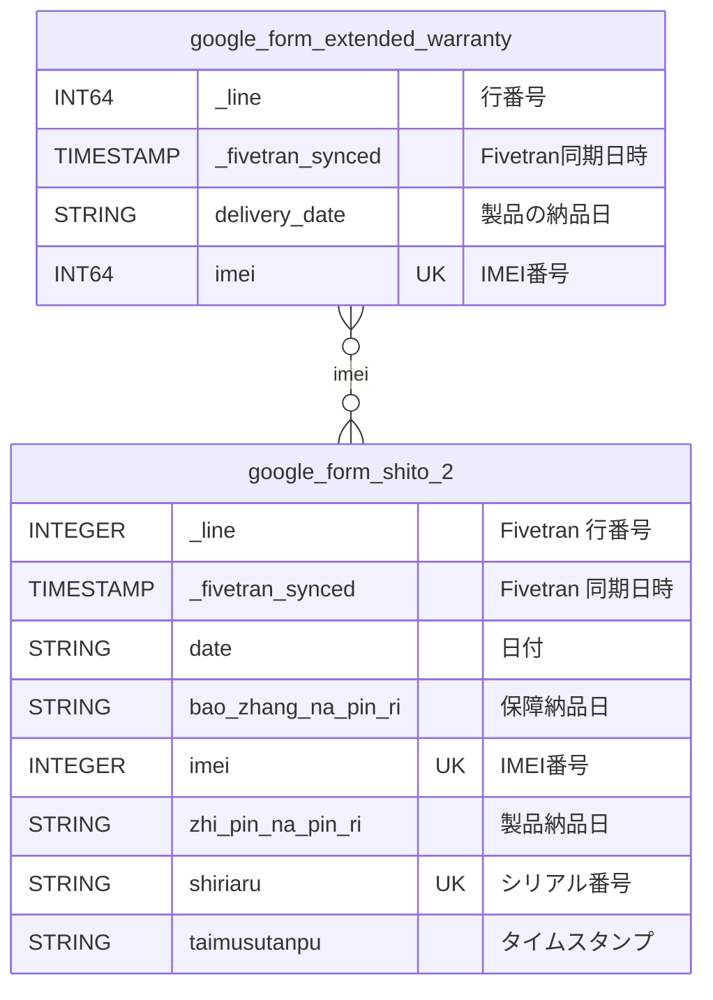

```mermaid
erDiagram
    %% =======================================================
    %% lake__extended_warranty__prod Schema
    %% Tables represent data sourced from Google Forms, primarily linked by IMEI.
    %% =======================================================
    
    google_form_extended_warranty {
        INT64 _line "行番号"
        TIMESTAMP _fivetran_synced "Fivetran同期日時"
        STRING delivery_date "製品の納品日"
        INT64 imei UK "IMEI番号"
    }
    
    google_form_shito_2 {
        INTEGER _line "Fivetran 行番号"
        TIMESTAMP _fivetran_synced "Fivetran 同期日時"
        STRING date "日付"
        STRING bao_zhang_na_pin_ri "保障納品日"
        INTEGER imei UK "IMEI番号"
        STRING zhi_pin_na_pin_ri "製品納品日"
        STRING shiriaru UK "シリアル番号"
        STRING taimusutanpu "タイムスタンプ"
    }
    
    %% -----------------------------------------------------------
    %% Relationships (Inferred based on IMEI uniqueness/similarity)
    %% -----------------------------------------------------------
    
    google_form_extended_warranty }o--o{ google_form_shito_2 : imei
```