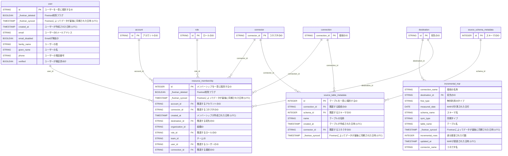

```mermaid
erDiagram
    %% =======================================================
    %% lake__fivetran_platform__prod Schema
    %% Master Tables (Defined in source)
    %% =======================================================
    
    user {
        STRING id PK "ユーザーを一意に識別するID"
        BOOLEAN _fivetran_deleted "Fivetran削除フラグ"
        TIMESTAMP _fivetran_synced "Fivetranによってデータが最後に同期された日時 (UTC)"
        TIMESTAMP created_at "ユーザーが作成された日時 (UTC)"
        STRING email "ユーザーのEメールアドレス"
        BOOLEAN email_disabled "Emailが無効か"
        STRING family_name "ユーザーの姓"
        STRING given_name "ユーザーの名"
        STRING phone "ユーザーの電話番号"
        BOOLEAN verified "ユーザーが検証済みか"
    }

    %% =======================================================
    %% Master Tables (Inferred minimally for relationships)
    %% =======================================================
    
    account {
        STRING id PK "アカウントのID"
    }
    
    connector {
        STRING connector_id PK "コネクタのID"
    }
    
    destination {
        STRING id PK "宛先のID"
    }
    
    role {
        STRING id PK "ロールのID"
    }
    
    connection {
        STRING connection_id PK "接続のID"
    }
    
    source_schema_metadata {
        INTEGER id PK "スキーマのID"
    }

    %% =======================================================
    %% Fact / Junction / Metadata Tables
    %% =======================================================
    
    incremental_mar {
        STRING connection_name "接続の名称"
        STRING destination_id FK "宛先のID"
        STRING free_type "無料利用のタイプ"
        DATE measured_date "MARが計測された日付"
        STRING schema_name "スキーマ名"
        STRING sync_type "同期タイプ"
        STRING table_name "テーブル名"
        TIMESTAMP _fivetran_synced "Fivetranによってデータが最後に同期された日時 (UTC)"
        INTEGER incremental_rows "差分更新された行数"
        TIMESTAMP updated_at "MARが更新された日時 (UTC)"
        STRING connector_name "コネクタ名"
    }
    
    resource_membership {
        INTEGER id PK "メンバーシップを⼀意に識別するID"
        BOOLEAN _fivetran_deleted "Fivetran削除フラグ"
        TIMESTAMP _fivetran_synced "Fivetranによってデータが最後に同期された日時 (UTC)"
        STRING account_id FK "関連するアカウントのID"
        STRING connector_id FK "関連するコネクタのID"
        TIMESTAMP created_at "メンバーシップが作成された日時 (UTC)"
        STRING destination_id FK "関連する宛先のID"
        STRING organization_id "組織ID"
        STRING role_id FK "関連するロールのID"
        STRING team_id "チームID"
        STRING user_id FK "関連するユーザーのID"
        STRING connection_id FK "関連する接続のID"
    }
    
    source_table_metadata {
        INTEGER id PK "テーブルを一意に識別するID"
        STRING connection_id FK "関連する接続のID"
        INTEGER schema_id FK "関連するスキーマのID"
        STRING name "テーブルの名称"
        TIMESTAMP created_at "テーブルが作成された日時 (UTC)"
        STRING connector_id FK "関連するコネクタのID"
        TIMESTAMP _fivetran_synced "Fivetranによってデータが最後に同期された日時 (UTC)"
    }

    %% -----------------------------------------------------------
    %% Relationships
    %% -----------------------------------------------------------
    
    destination ||--o{ incremental_mar : destination_id
    
    user ||--o{ resource_membership : user_id
    account ||--o{ resource_membership : account_id
    connector ||--o{ resource_membership : connector_id
    destination ||--o{ resource_membership : destination_id
    role ||--o{ resource_membership : role_id
    connection ||--o{ resource_membership : connection_id
    
    connection ||--o{ source_table_metadata : connection_id
    source_schema_metadata ||--o{ source_table_metadata : schema_id
    connector ||--o{ source_table_metadata : connector_id
```