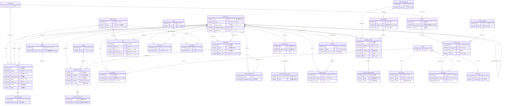

```mermaid
erDiagram
    %% =======================================================
    %% Master Tables (Dimensions)
    %% =======================================================
    
    service_user {
        INTEGER id PK "ユーザーを一意に識別するID"
        BOOLEAN active "アクティブフラグ"
        STRING primary_email "主要なEメールアドレス"
        INTEGER reporting_manager_id FK "上長ID"
        INTEGER location_id FK "ロケーションID"
    }
    
    department {
        INTEGER id PK "部署ID"
        STRING name "部署の名称"
        INTEGER head_user_id FK "部署長ID"
        INTEGER prime_user_id FK "プライムユーザーID"
    }
    
    role {
        INTEGER id PK "ロールID"
        STRING name "ロールの名称"
    }
    
    service_group {
        INTEGER id PK "グループID"
        STRING name "グループの名称"
        INTEGER escalate_to FK "エスカレーション先ID"
    }
    
    asset_type {
        INTEGER id PK "資産タイプID"
        %% Other inferred columns
    }
    
    location {
        INTEGER id PK "ロケーションID"
        INTEGER primary_contact_id FK "主要連絡先ID (Inferred)"
    }
    
    vendor {
        INTEGER id PK "ベンダーID"
        STRING name "ベンダー名"
    }
    
    ticket {
        INTEGER id PK "チケットID"
        %% Other inferred columns
    }
    
    service_category {
        INTEGER id PK "サービスカテゴリID"
        STRING name "カテゴリ名"
    }

    product {
        INTEGER id PK "製品ID"
        INTEGER asset_type_id FK "関連する資産タイプのID"
        STRING name "製品名"
    }
    
    software {
        INTEGER id PK "ソフトウェアID"
        STRING name "ソフトウェア名"
        INTEGER managed_by_id FK "管理者ID"
    }
    
    solution_category {
        INTEGER id PK "カテゴリID"
        STRING name "カテゴリ名"
    }

    solution_folder {
        INTEGER id PK "フォルダID"
        INTEGER category_id FK "関連するカテゴリのID"
        STRING name "フォルダ名"
    }

    %% =======================================================
    %% Transactional / Fact Tables
    %% =======================================================

    asset {
        INTEGER id PK "資産ID"
        INTEGER agent_id FK "担当エージェントID"
        INTEGER asset_type_id FK "資産タイプID"
        INTEGER department_id FK "部署ID"
        INTEGER group_id FK "グループID"
        INTEGER location_id FK "ロケーションID"
        INTEGER user_id FK "使用者ID"
        STRING name "資産名"
    }

    announcement {
        INTEGER id PK "お知らせID"
        INTEGER created_by FK "作成者ID"
        STRING title "タイトル"
    }
    
    purchase_order {
        INTEGER id PK "発注ID"
        INTEGER created_by FK "作成者ID"
        INTEGER department_id FK "部署ID"
        INTEGER vendor_id FK "ベンダーID"
        STRING po_number "発注番号"
    }

    service_item {
        INTEGER id PK "サービスアイテムID"
        INTEGER category_id FK "カテゴリID"
        INTEGER product_id FK "製品ID"
        STRING name "アイテム名"
    }

    solution_article {
        INTEGER id PK "記事ID"
        INTEGER category_id FK "カテゴリID"
        INTEGER folder_id FK "フォルダID"
        INTEGER modified_by FK "変更者ID"
        INTEGER user_id FK "作成ユーザーID"
        STRING title "タイトル"
    }
    
    conversation {
        INTEGER id PK "会話ID"
        INTEGER ticket_id FK "関連するチケットのID"
        INTEGER user_id FK "ユーザーID"
    }

    task {
        INTEGER id PK "タスクID"
        INTEGER agent_id FK "担当エージェントID"
        INTEGER group_id FK "担当グループのID"
        INTEGER parent_object_id "親オブジェクトID"
        STRING parent_object_type "親オブジェクトタイプ"
    }

    %% =======================================================
    %% Junction / Bridge Tables
    %% =======================================================
    
    agent_department {
        INTEGER agent_id PK "エージェントID"
        INTEGER department_id PK "部署ID"
    }

    agent_role {
        INTEGER agent_id PK "エージェントID"
        INTEGER role_id PK "ロールID"
    }
    
    announcement_email {
        INTEGER announcement_id FK "お知らせID"
        STRING email "通知先Email"
        %% PK is likely a composite key involving email and announcement_id
    }
    
    asset_component {
        INTEGER id PK "コンポーネントID"
        INTEGER asset_id FK "資産ID"
    }
    
    purchase_order_item {
        INTEGER id PK "発注項目ID"
        INTEGER order_id FK "関連する発注のID"
    }

    software_user {
        INTEGER id PK "ソフトウェアユーザーID"
        INTEGER software_id FK "ソフトウェアID"
        INTEGER user_id FK "ユーザーID"
    }
    
    solution_article_feature {
        INTEGER article_id PK "記事ID"
        STRING type PK "機能のタイプ"
        STRING value PK "機能の値"
    }
    
    ticket_email {
        INTEGER ticket_id PK "チケットID"
        STRING type PK "Eメールのタイプ"
        STRING email "関連するEmail"
    }
    
    ticket_item {
        INTEGER id PK "チケットアイテムID"
        INTEGER service_item_id FK "サービスアイテムID"
        INTEGER ticket_id FK "チケットID"
    }
    
    ticket_tag {
        INTEGER ticket_id PK "チケットID"
        STRING tag_name PK "タグ名"
    }

    user_group {
        INTEGER group_id PK "グループID"
        INTEGER user_id PK "ユーザーID"
    }

    %% =======================================================
    %% Relationships
    %% =======================================================
    
    %% User/Agent Relationships
    service_user ||--o{ service_user : reporting_manager_id
    service_user ||--o{ asset : user_id
    service_user ||--o{ announcement : created_by
    service_user ||--o{ conversation : user_id
    service_user ||--o{ purchase_order : created_by
    service_user ||--o{ software : managed_by_id
    service_user ||--o{ software_user : user_id
    service_user ||--o{ solution_article : modified_by
    service_user ||--o{ solution_article : user_id
    service_user ||--o{ user_group : user_id
    service_user ||--o{ department : head_user_id
    service_user ||--o{ department : prime_user_id
    
    %% Agent/Role/Department Junction
    service_user }o--o{ agent_department : agent_id
    department ||--o{ agent_department : department_id
    service_user }o--o{ agent_role : agent_id
    role ||--o{ agent_role : role_id
    
    %% ITIL/Asset Relationships
    asset_type ||--o{ asset : asset_type_id
    asset_type ||--o{ product : asset_type_id
    asset ||--o{ asset_component : asset_id
    
    %% Configuration Management / Products
    product ||--o{ service_item : product_id
    service_category ||--o{ service_item : category_id
    service_item ||--o{ ticket_item : service_item_id
    
    %% ITSM Flows (Tickets)
    ticket ||--o{ conversation : ticket_id
    ticket ||--o{ ticket_email : ticket_id
    ticket ||--o{ ticket_item : ticket_id
    ticket ||--o{ ticket_tag : ticket_id
    
    %% Inventory / Procurement
    vendor ||--o{ purchase_order : vendor_id
    purchase_order ||--o{ purchase_order_item : order_id
    department ||--o{ purchase_order : department_id
    
    %% Knowledge Base
    solution_category ||--o{ solution_folder : category_id
    solution_category ||--o{ solution_article : category_id
    solution_folder ||--o{ solution_article : folder_id
    solution_article ||--o{ solution_article_feature : article_id
    
    %% Software/User Licensing
    software ||--o{ software_user : software_id
    
    %% Group/User Junction
    service_group ||--o{ user_group : group_id
    
    %% General Asset/Group/Location/Task Links
    service_group ||--o{ asset : group_id
    service_group ||--o{ task : group_id
    service_user ||--o{ asset : agent_id
    service_user ||--o{ task : agent_id
    location ||--o{ asset : location_id
    service_user ||--o{ location : location_id
    
    %% Announcement Details
    announcement ||--o{ announcement_email : announcement_id
```