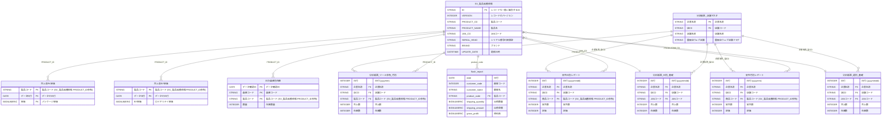

```mermaid
erDiagram
    %% =======================================================
    %% Master / Dimension Tables
    %% =======================================================
    
    SV_製品発番情報 {
        STRING ID PK "レコードを一意に識別するID"
        INTEGER VERSION "レコードのバージョン"
        STRING PRODUCT_CD "製品コード"
        STRING PRODUCT_NAME "製品名"
        STRING JAN_CD "JANコード"
        STRING SERIAL_HEAD "シリアル番号の接頭辞"
        STRING BRAND "ブランド"
        DATETIME UPDATE_DATE "更新日時"
    }

    分析帳票_店舗マスタ {
        STRING 企業名称 PK "企業名称"
        STRING 店CD PK "店舗コード"
        STRING 店舗名称 "店舗名称"
        STRING 量販店ウェブ店舗 "量販店ウェブ店舗フラグ"
    }
    
    %% =======================================================
    %% Fact / Report Tables
    %% =======================================================
    
    flash_report {
        DATE date "日付"
        INTEGER customer_code "顧客コード"
        STRING customer_name "顧客名"
        STRING product_code FK "製品コード"
        BIGNUMERIC shipping_quantity "出荷数量"
        BIGNUMERIC shipping_amount "出荷金額"
        BIGNUMERIC gross_profit "粗利益"
    }
    
    分析帳票_ツール参照_月別 {
        INTEGER 日付 "日付 (yyyymm)"
        STRING 企業名称 FK "企業名称"
        STRING 店CD FK "店舗コード"
        STRING 製品コード FK "製品コード (SV_製品発番情報.PRODUCT_ID参照)"
        INTEGER 売上数 "売上数"
        INTEGER 在庫数 "在庫数"
    }
    
    分析帳票_日別_基礎 {
        INTEGER 日付 "日付 (yyyymmdd)"
        STRING 企業名称 FK "企業名称"
        STRING 店CD FK "店舗コード"
        STRING JANコード FK "JANコード"
        INTEGER 売上数 "売上数"
        INTEGER 在庫数 "在庫数"
    }

    分析帳票_週別_基礎 {
        INTEGER 日付 "日付 (yyyymmdd)"
        STRING 企業名称 FK "企業名称"
        STRING 店CD FK "店舗コード"
        STRING JANコード FK "JANコード"
        INTEGER 売上数 "売上数"
        INTEGER 在庫数 "在庫数"
    }
    
    売上表PK単価 {
        STRING 製品コード PK "製品コード (SV_製品発番情報.PRODUCT_ID参照)"
        DATE データ日付 PK "データの日付"
        BIGNUMERIC 単価 PK "パッケージ単価"
    }

    売上表RY単価 {
        STRING 製品コード PK "製品コード (SV_製品発番情報.PRODUCT_ID参照)"
        DATE データ日付 PK "データの日付"
        BIGNUMERIC RY単価 "ロイヤリティ単価"
    }

    実売日別レポート {
        INTEGER 日付 "日付 (yyyymmdd)"
        STRING 企業名称 FK "企業名称"
        STRING 店CD FK "店舗コード"
        STRING 商品コード FK "製品コード (SV_製品発番情報.PRODUCT_ID参照)"
        INTEGER 実売数 "実売数"
        INTEGER 定価 "定価"
    }

    実売月別レポート {
        INTEGER 日付 "日付 (yyyymm)"
        STRING 企業名称 FK "企業名称"
        STRING 店CD FK "店舗コード"
        STRING 商品コード FK "製品コード (SV_製品発番情報.PRODUCT_ID参照)"
        INTEGER 実売数 "実売数"
        INTEGER 定価 "定価"
    }

    日次倉庫別在庫 {
        DATE データ確認日 PK "データ確認日"
        STRING 倉庫コード PK "倉庫コード"
        STRING 製品コード PK "製品コード (SV_製品発番情報.PRODUCT_ID参照)"
        INTEGER 数量 "在庫数量"
    }

    %% -----------------------------------------------------------
    %% Relationships
    %% -----------------------------------------------------------
    
    %% Product Master Links (using PRODUCT_CD or PRODUCT_ID equivalent)
    SV_製品発番情報 ||--o{ 売上表PK単価 : PRODUCT_ID
    SV_製品発番情報 ||--o{ 売上表RY単価 : PRODUCT_ID
    SV_製品発番情報 ||--o{ 分析帳票_ツール参照_月別 : PRODUCT_ID
    SV_製品発番情報 ||--o{ 実売日別レポート : PRODUCT_ID
    SV_製品発番情報 ||--o{ 実売月別レポート : PRODUCT_ID
    SV_製品発番情報 ||--o{ 日次倉庫別在庫 : PRODUCT_ID
    SV_製品発番情報 ||--o{ flash_report : product_code

    %% Store Master Links (using 企業名称 and 店CD)
    %% MODIFIED: Replaced comma (,) with underscore (_) in relationship labels
    分析帳票_店舗マスタ ||--o{ 分析帳票_ツール参照_月別 : 企業名称_店CD
    分析帳票_店舗マスタ ||--o{ 分析帳票_日別_基礎 : 企業名称_店CD
    分析帳票_店舗マスタ ||--o{ 分析帳票_週別_基礎 : 企業名称_店CD
    分析帳票_店舗マスタ ||--o{ 実売日別レポート : 企業名称_店CD
    分析帳票_店舗マスタ ||--o{ 実売月別レポート : 企業名称_店CD

    %% Indirect Product Links (via JANコード)
    SV_製品発番情報 }o--|| 分析帳票_日別_基礎 : JAN_CD
    SV_製品発番情報 }o--|| 分析帳票_週別_基礎 : JAN_CD
```