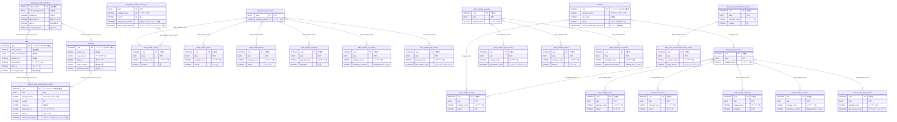

```mermaid
erDiagram
    %% =======================================================
    %% Transaction and Detailed Report Tables
    %% =======================================================

    sales {
        INTEGER _line PK "ソースファイル内の行番号"
        STRING order_number "注文番号"
        DATE order_charged_date "請求日"
        STRING product_id "製品ID"
        STRING base_plan_id "ベースプランID"
        STRING offer_id "オファーID"
        STRING country_of_buyer "購入者の国"
    }

    earnings {
        INTEGER _line PK "ソースファイル内の行番号"
        STRING product_id "製品ID"
        STRING base_plan_id "ベースプランID"
        STRING offer_id "オファーID"
        STRING buyer_country "購入者の国"
        STRING transaction_type "取引タイプ"
    }
    
    googleplay_sales_report_sn {
        STRING order_number PK "注文番号"
        DATE order_charged_date "注文日"
        STRING product_id "製品ID"
        STRING base_plan_id "基本プランID"
        STRING offer_id "販売種別ID"
        STRING country_of_buyer "国コード"
    }
    
    financial_stats_subscriptions_country {
        INTEGER _line PK "ソースファイル内の行番号"
        DATE date "日付"
        STRING package_name "アプリのパッケージ名"
        STRING country "国"
        STRING product_id "製品ID"
        STRING base_plan_id "ベースプランID"
        STRING offer_id "オファーID"
        INTEGER active_subscriptions "アクティブなサブスクリプション数"
    }
    
    reviews {
        INTEGER _line PK "ソースファイル内の行番号"
        STRING package_name "アプリのパッケージ名"
        INTEGER star_rating "星評価"
        STRING device "レビュー時のデバイス"
        TIMESTAMP review_submit_date_and_time "レビュー投稿日時"
    }

    googleplay_installs_country_sn {
        DATE date PK "日付"
        STRING package_name PK "パッケージ名"
        STRING country PK "国"
        INTEGER daily_device_installs "日次デバイスインストール数"
        INTEGER active_device_installs "アクティブデバイスインストール数"
    }
    
    %% =======================================================
    %% Statistical Aggregates (Granular Dimensions)
    %% =======================================================
    
    %% Install Statistics
    stats_installs_overview {
        DATE date PK "日付"
        STRING package_name PK "パッケージ名"
    }
    stats_installs_country {
        INTEGER _line PK "行番号"
        DATE date "日付"
        STRING package_name "パッケージ名"
        STRING country "国"
    }
    stats_installs_carrier {
        INTEGER _line PK "行番号"
        DATE date "日付"
        STRING package_name "パッケージ名"
        STRING carrier "キャリア"
    }
    stats_installs_device {
        INTEGER _line PK "行番号"
        DATE date "日付"
        STRING package_name "パッケージ名"
        STRING device "デバイス"
    }
    stats_installs_language {
        INTEGER _line PK "行番号"
        DATE date "日付"
        STRING package_name "パッケージ名"
        STRING language "言語"
    }
    stats_installs_os_version {
        INTEGER _line PK "行番号"
        DATE date "日付"
        STRING package_name "パッケージ名"
        STRING android_os_version "Android OSバージョン"
    }
    stats_installs_app_version {
        INTEGER _line PK "行番号"
        DATE date "日付"
        STRING package_name "パッケージ名"
        INTEGER app_version_code "アプリバージョンコード"
    }

    %% Rating Statistics
    stats_ratings_overview {
        INTEGER _line PK "行番号"
        DATE date "日付"
        STRING package_name "パッケージ名"
    }
    stats_ratings_country {
        INTEGER _line PK "行番号"
        DATE date "日付"
        STRING package_name "パッケージ名"
        STRING country "国"
    }
    stats_ratings_carrier {
        INTEGER _line PK "行番号"
        DATE date "日付"
        STRING package_name "パッケージ名"
        STRING carrier "キャリア"
    }
    stats_ratings_device {
        INTEGER _line PK "行番号"
        DATE date "日付"
        STRING package_name "パッケージ名"
        STRING device "デバイス"
    }
    stats_ratings_language {
        INTEGER _line PK "行番号"
        DATE date "日付"
        STRING package_name "パッケージ名"
        STRING language "言語"
    }
    stats_ratings_os_version {
        INTEGER _line PK "行番号"
        DATE date "日付"
        STRING package_name "パッケージ名"
        STRING android_os_version "Android OSバージョン"
    }
    stats_ratings_app_version {
        INTEGER _line PK "行番号"
        DATE date "日付"
        STRING package_name "パッケージ名"
        INTEGER app_version_code "アプリバージョンコード"
    }

    %% Crash Statistics
    stats_crashes_overview {
        INTEGER _line PK "行番号"
        DATE date "日付"
        STRING package_name "パッケージ名"
    }
    stats_crashes_app_version {
        INTEGER _line PK "行番号"
        DATE date "日付"
        STRING package_name "パッケージ名"
        INTEGER app_version_code "アプリバージョンコード"
    }
    stats_crashes_device {
        INTEGER _line PK "行番号"
        DATE date "日付"
        STRING package_name "パッケージ名"
        STRING device "デバイス"
    }
    stats_crashes_os_version {
        INTEGER _line PK "行番号"
        DATE date "日付"
        STRING package_name "パッケージ名"
        STRING android_os_version "Android OSバージョン"
    }
    
    %% Store Performance Statistics
    stats_store_performance_country {
        INTEGER _line PK "行番号"
        DATE date "日付"
        STRING package_name "パッケージ名"
        STRING country "国"
    }
    stats_store_performance_traffic_source {
        INTEGER _line PK "行番号"
        DATE date "日付"
        STRING package_name "パッケージ名"
        STRING traffic_source "トラフィックソース"
    }

    %% -----------------------------------------------------------
    %% Relationships (Inferred by common transaction/product IDs)
    %% MODIFIED: Replaced commas in labels with underscores
    %% -----------------------------------------------------------
    
    %% Sales/Transaction Links (Inferred by order number and product context)
    googleplay_sales_report_sn }o--o{ sales : order_number_product_id_offer_id
    googleplay_sales_report_sn }o--o{ earnings : product_id_base_plan_id_offer_id

    %% Subscription/Financial Links (High granularity linkage)
    sales }o--o{ financial_stats_subscriptions_country : product_id_base_plan_id_offer_id
    earnings }o--o{ financial_stats_subscriptions_country : product_id_base_plan_id_offer_id

    %% Reviews to Ratings (Implicit linkage via package_name and time)
    reviews }o--o{ stats_ratings_overview : package_name
    reviews }o--o{ stats_ratings_country : package_name

    %% Cross-Dimensional Statistics (All stats share Package Name + Date)
    stats_installs_overview }o--o{ stats_installs_country : date_package_name
    stats_installs_overview }o--o{ stats_installs_carrier : date_package_name
    stats_installs_overview }o--o{ stats_installs_device : date_package_name
    stats_installs_overview }o--o{ stats_installs_language : date_package_name
    stats_installs_overview }o--o{ stats_installs_os_version : date_package_name
    stats_installs_overview }o--o{ stats_installs_app_version : date_package_name

    stats_ratings_overview }o--o{ stats_ratings_country : date_package_name
    stats_ratings_overview }o--o{ stats_ratings_carrier : date_package_name
    stats_ratings_overview }o--o{ stats_ratings_device : date_package_name
    stats_ratings_overview }o--o{ stats_ratings_language : date_package_name
    stats_ratings_overview }o--o{ stats_ratings_os_version : date_package_name
    stats_ratings_overview }o--o{ stats_ratings_app_version : date_package_name

    stats_crashes_overview }o--o{ stats_crashes_app_version : date_package_name
    stats_crashes_overview }o--o{ stats_crashes_device : date_package_name
    stats_crashes_overview }o--o{ stats_crashes_os_version : date_package_name

    stats_store_performance_country }o--o{ stats_store_performance_traffic_source : date_package_name
    googleplay_installs_country_sn }o--o{ stats_installs_country : date_package_name_country
```