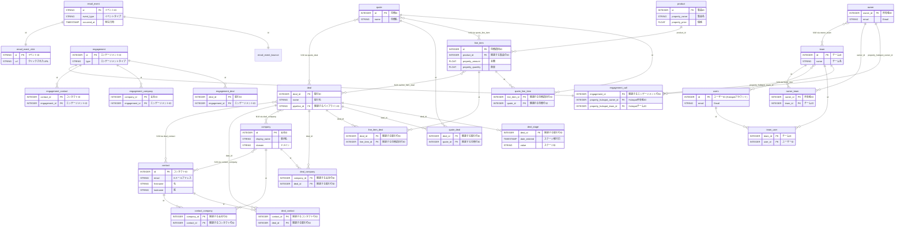

```mermaid
erDiagram
    %% =======================================================
    %% Core CRM Objects (Masters / Dimensions)
    %% =======================================================
    
    company {
        INTEGER id PK "会社ID"
        STRING display_name "表示名"
        STRING domain "ドメイン"
    }
    
    contact {
        INTEGER id PK "コンタクトID"
        STRING email "Eメールアドレス"
        STRING firstname "名"
        STRING lastname "姓"
    }
    
    deal {
        INTEGER deal_id PK "取引ID"
        STRING name "取引名"
        STRING pipeline_id FK "関連するパイプラインID"
    }
    
    product {
        INTEGER id PK "製品ID"
        STRING property_name "製品名"
        FLOAT property_price "価格"
    }
    
    line_item {
        INTEGER id PK "見積項目ID"
        INTEGER product_id FK "関連する製品のID"
        FLOAT property_amount "金額"
        FLOAT property_quantity "数量"
    }
    
    quote {
        INTEGER id PK "見積ID"
        STRING name "見積名"
    }

    engagement {
        INTEGER id PK "エンゲージメントID"
        STRING type "エンゲージメントタイプ"
    }

    owner {
        INTEGER owner_id PK "所有者ID"
        STRING email "Email"
    }

    users {
        INTEGER id PK "ユーザーID (Hubspotアカウント)"
        STRING email "Email"
    }

    team {
        INTEGER id PK "チームID"
        STRING name "チーム名"
    }
    
    email_event {
        STRING id PK "イベントID"
        STRING event_type "イベントタイプ"
        TIMESTAMP occurred_at "発生日時"
    }

    %% =======================================================
    %% Junction Tables (N:M Relationships & Hierarchy)
    %% =======================================================

    contact_company {
        INTEGER company_id PK "関連する会社のID"
        INTEGER contact_id PK "関連するコンタクトのID"
    }
    
    deal_contact {
        INTEGER contact_id PK "関連するコンタクトのID"
        INTEGER deal_id PK "関連する取引のID"
    }
    
    deal_company {
        INTEGER company_id PK "関連する会社のID"
        INTEGER deal_id PK "関連する取引のID"
    }

    line_item_deal {
        INTEGER deal_id PK "関連する取引のID"
        INTEGER line_item_id PK "関連する見積項目のID"
    }
    
    quote_line_item {
        INTEGER line_item_id PK "関連する見積項目のID"
        INTEGER quote_id PK "関連する見積のID"
    }

    quote_deal {
        INTEGER deal_id PK "関連する取引のID"
        INTEGER quote_id PK "関連する見積のID"
    }
    
    owner_team {
        INTEGER owner_id PK "所有者ID"
        INTEGER team_id PK "チームID"
    }

    team_user {
        INTEGER team_id PK "チームID"
        INTEGER user_id PK "ユーザーID"
    }

    engagement_contact {
        INTEGER contact_id PK "コンタクトID"
        INTEGER engagement_id PK "エンゲージメントID"
    }

    engagement_company {
        INTEGER company_id PK "会社ID"
        INTEGER engagement_id PK "エンゲージメントID"
    }
    
    engagement_deal {
        INTEGER deal_id PK "取引ID"
        INTEGER engagement_id PK "エンゲージメントID"
    }
    
    %% =======================================================
    %% Detail Tables (1:1/1:M Extensions)
    %% =======================================================

    engagement_call {
        INTEGER engagement_id PK "関連するエンゲージメントのID"
        INTEGER property_hubspot_owner_id FK "Hubspot所有者ID"
        INTEGER property_hubspot_team_id FK "HubspotチームID"
    }
    
    email_event_click {
        STRING id PK "イベントID"
        STRING url "クリックされたURL"
    }

    deal_stage {
        INTEGER deal_id FK "関連する取引のID"
        TIMESTAMP date_entered "ステージ移行日"
        STRING value "ステージID"
    }

    %% -----------------------------------------------------------
    %% Relationships
    %% -----------------------------------------------------------
    
    %% Core CRM N:M Relationships
    company }o--o{ contact : "N:M via contact_company"
    company ||--o{ contact_company : id
    contact ||--o{ contact_company : id
    
    deal }o--o{ contact : "N:M via deal_contact"
    deal ||--o{ deal_contact : deal_id
    contact ||--o{ deal_contact : id
    
    deal }o--o{ company : "N:M via deal_company"
    deal ||--o{ deal_company : deal_id
    company ||--o{ deal_company : id
    
    %% Sales Pipeline (Quotes & Line Items)
    product ||--o{ line_item : product_id
    line_item }o--o{ deal : "N:M via line_item_deal"
    line_item ||--o{ line_item_deal : id
    deal ||--o{ line_item_deal : deal_id
    
    quote }o--o{ deal : "N:M via quote_deal"
    quote ||--o{ quote_deal : id
    deal ||--o{ quote_deal : deal_id

    quote }o--o{ line_item : "N:M via quote_line_item"
    quote ||--o{ quote_line_item : id
    line_item ||--o{ quote_line_item : id
    
    %% Activities and Events
    engagement ||--|| engagement_call : engagement_id
    engagement ||--o{ engagement_contact : id
    engagement ||--o{ engagement_company : id
    engagement ||--o{ engagement_deal : id
    
    email_event ||--|| email_event_click : id
    email_event ||--|| email_event_bounce : id
    
    deal ||--o{ deal_stage : deal_id

    %% Ownership and Hierarchy
    owner }o--o{ team : "N:M via owner_team"
    owner ||--o{ owner_team : owner_id
    team ||--o{ owner_team : id

    team }o--o{ users : "N:M via team_user"
    team ||--o{ team_user : id
    users ||--o{ team_user : id
    
    owner ||--o{ engagement_call : property_hubspot_owner_id
    team ||--o{ engagement_call : property_hubspot_team_id
```