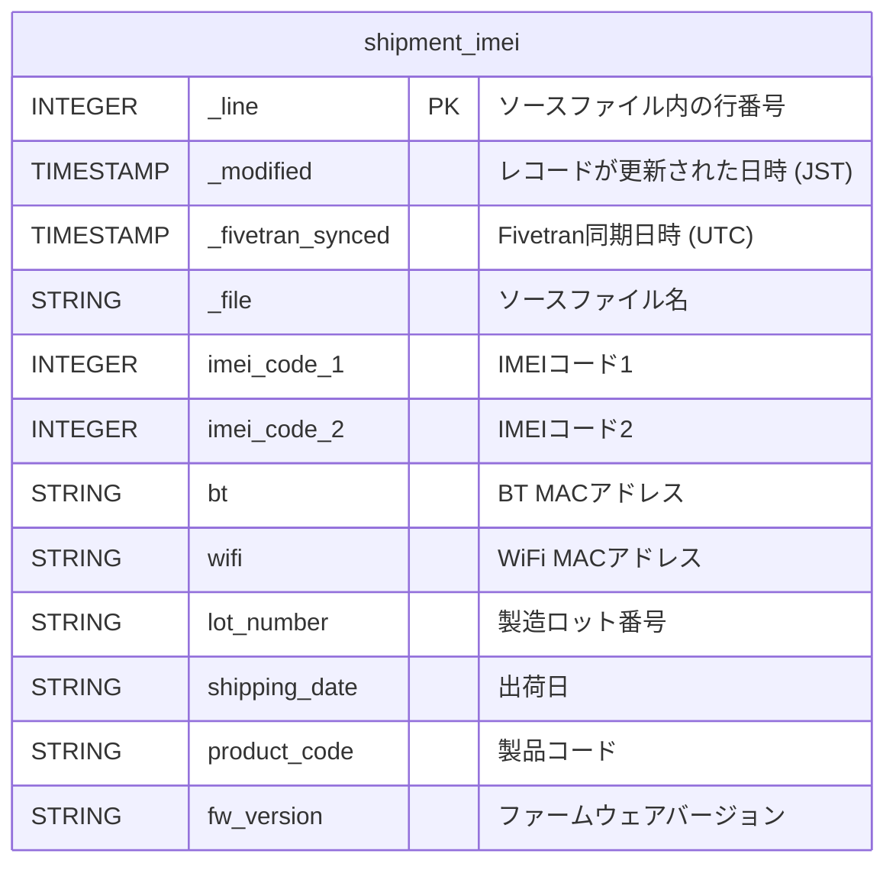

```mermaid
erDiagram
    %% =======================================================
    %% lake__jenesis_drive__prod Schema Analysis
    %% NOTE: Only one non-template table (shipment_imei) exists,
    %% so no internal relationships can be inferred.
    %% =======================================================
    
    shipment_imei {
        INTEGER _line PK "ソースファイル内の行番号"
        TIMESTAMP _modified "レコードが更新された日時 (JST)"
        TIMESTAMP _fivetran_synced "Fivetran同期日時 (UTC)"
        STRING _file "ソースファイル名"
        INTEGER imei_code_1 "IMEIコード1"
        INTEGER imei_code_2 "IMEIコード2"
        STRING bt "BT MACアドレス"
        STRING wifi "WiFi MACアドレス"
        STRING lot_number "製造ロット番号"
        STRING shipping_date "出荷日"
        STRING product_code "製品コード"
        STRING fw_version "ファームウェアバージョン"
    }
    
    %% -----------------------------------------------------------
    %% Relationships (None inferred within this schema)
    %% -----------------------------------------------------------
```