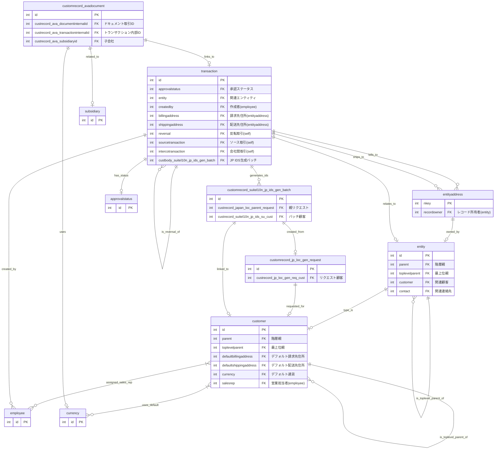

```mermaid
erDiagram
    customer {
        int id PK
        int parent FK "階層親"
        int toplevelparent FK "最上位親"
        int defaultbillingaddress FK "デフォルト請求先住所"
        int defaultshippingaddress FK "デフォルト配送先住所"
        int currency FK "デフォルト通貨"
        int salesrep FK "営業担当者(employee)"
    }
    entity {
        int id PK
        int parent FK "階層親"
        int toplevelparent FK "最上位親"
        int customer FK "関連顧客"
        int contact FK "関連連絡先"
    }
    transaction {
        int id PK
        int approvalstatus FK "承認ステータス"
        int entity FK "関連エンティティ"
        int createdby FK "作成者(employee)"
        int billingaddress FK "請求先住所(entityaddress)"
        int shippingaddress FK "配送先住所(entityaddress)"
        int reversal FK "反転取引(self)"
        int sourcetransaction FK "ソース取引(self)"
        int intercotransaction FK "会社間取引(self)"
        int custbody_suitel10n_jp_ids_gen_batch FK "JP IDS生成バッチ"
    }
    entityaddress {
        int nkey PK
        int recordowner FK "レコード所有者(entity)"
    }
    customrecord_jp_loc_gen_request {
        int id PK
        int custrecord_jp_loc_gen_req_cust FK "リクエスト顧客"
    }
    customrecord_suitel10n_jp_ids_gen_batch {
        int id PK
        int custrecord_japan_loc_parent_request FK "親リクエスト"
        int custrecord_suitel10n_jp_ids_su_cust FK "バッチ顧客"
    }
    customrecord_avadocument {
        int id PK
        int custrecord_ava_documentinternalid FK "ドキュメント取引ID"
        int custrecord_ava_transactioninternalid FK "トランザクション内部ID"
        int custrecord_ava_subsidiaryid FK "子会社"
    }
    
    employee {
        int id PK
    }
    approvalstatus {
        int id PK
    }
    currency {
        int id PK
    }
    subsidiary {
        int id PK
    }

    customer ||--o{ customer : is_parent_of
    customer ||--o{ customer : is_toplevel_parent_of
    customer }|--o{ employee : assigned_sales_rep
    customer }|--o{ currency : uses_default

    entity ||--o{ entity : is_parent_of
    entity ||--o{ entity : is_toplevel_parent_of
    entity ||--o| customer : type_is

    entityaddress ||--o| entity : owned_by

    transaction ||--o| entity : relates_to
    transaction ||--o| approvalstatus : has_status
    transaction ||--o{ employee : created_by
    transaction ||--o{ entityaddress : bills_to
    transaction ||--o{ entityaddress : ships_to
    transaction ||--o{ transaction : is_source_of
    transaction ||--o{ transaction : is_reversal_of

    customrecord_jp_loc_gen_request ||--o| customer : requested_for
    
    customrecord_suitel10n_jp_ids_gen_batch ||--o| customer : linked_to
    customrecord_suitel10n_jp_ids_gen_batch ||--o| customrecord_jp_loc_gen_request : created_from

    customrecord_avadocument ||--o| transaction : links_to
    customrecord_avadocument ||--o| subsidiary : related_to
    customrecord_avadocument ||--o| currency : uses
    
    transaction ||--o{ customrecord_suitel10n_jp_ids_gen_batch : generates_ids
```