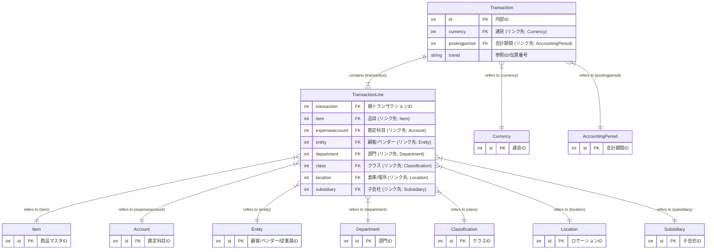

```mermaid
erDiagram
    %% ---------------------------------------------------------
    %% 中心となるトランザクション (Header & Line)
    %% ---------------------------------------------------------
    Transaction ||--|{ TransactionLine : "contains (transaction)"
    
    Transaction {
        int id PK "内部ID"
        int currency FK "通貨 (リンク先: Currency)"
        int postingperiod FK "会計期間 (リンク先: AccountingPeriod)"
        string tranid "参照ID/伝票番号"
    }

    TransactionLine {
        int transaction FK "親トランザクションID"
        int item FK "品目 (リンク先: Item)"
        int expenseaccount FK "勘定科目 (リンク先: Account)"
        int entity FK "顧客/ベンダー (リンク先: Entity)"
        int department FK "部門 (リンク先: Department)"
        int class FK "クラス (リンク先: Classification)"
        int location FK "倉庫/場所 (リンク先: Location)"
        int subsidiary FK "子会社 (リンク先: Subsidiary)"
    }

    %% ---------------------------------------------------------
    %% 明細 (Line) に紐づくマスタ
    %% ---------------------------------------------------------
    TransactionLine }|--|| Item : "refers to (item)"
    Item {
        int id PK "商品マスタID"
    }

    TransactionLine }|--|| Account : "refers to (expenseaccount)"
    Account {
        int id PK "勘定科目ID"
    }

    TransactionLine }|--|| Entity : "refers to (entity)"
    Entity {
        int id PK "顧客/ベンダー/従業員ID"
    }

    TransactionLine }|--|| Department : "refers to (department)"
    Department {
        int id PK "部門ID"
    }

    %% 修正: Class を Classification に変更して予約語エラーを回避
    TransactionLine }|--|| Classification : "refers to (class)"
    Classification {
        int id PK "クラスID"
    }

    TransactionLine }|--|| Location : "refers to (location)"
    Location {
        int id PK "ロケーションID"
    }

    TransactionLine }|--|| Subsidiary : "refers to (subsidiary)"
    Subsidiary {
        int id PK "子会社ID"
    }

    %% ---------------------------------------------------------
    %% ヘッダー (Transaction) に紐づくマスタ
    %% ---------------------------------------------------------
    Transaction }|--|| Currency : "refers to (currency)"
    Currency {
        int id PK "通貨ID"
    }

    Transaction }|--|| AccountingPeriod : "refers to (postingperiod)"
    AccountingPeriod {
        int id PK "会計期間ID"
    }
```