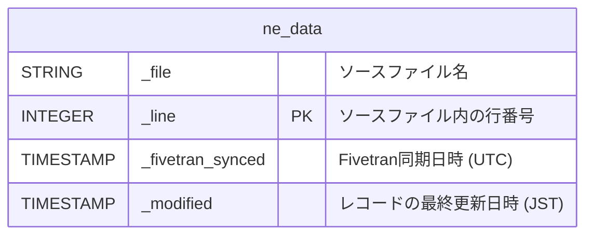

```mermaid
erDiagram
    %% =======================================================
    %% lake__next_engine__prod Schema Analysis
    %% NOTE: Only one non-template table (ne_data) exists,
    %% so no internal relationships can be inferred.
    %% =======================================================
    
    ne_data {
        STRING _file "ソースファイル名"
        INTEGER _line PK "ソースファイル内の行番号"
        TIMESTAMP _fivetran_synced "Fivetran同期日時 (UTC)"
        TIMESTAMP _modified "レコードの最終更新日時 (JST)"
        %% ネクストエンジンデータ (カラム名は省略)
    }
    
    %% -----------------------------------------------------------
    %% Relationships (None inferred within this schema)
    %% -----------------------------------------------------------
```