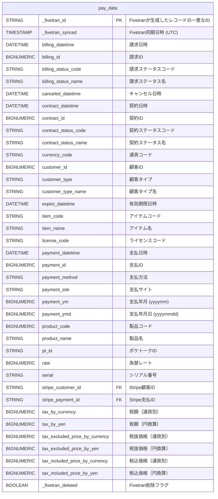

```mermaid
erDiagram
    %% =======================================================
    %% lake__payserver__prod Schema Analysis
    %% NOTE: Only one non-template table (pay_data) exists,
    %% so no internal relationships can be inferred.
    %% =======================================================
    
    pay_data {
        STRING _fivetran_id PK "Fivetranが生成したレコードの一意なID"
        TIMESTAMP _fivetran_synced "Fivetran同期日時 (UTC)"
        DATETIME billing_datetime "請求日時"
        BIGNUMERIC billing_id "請求ID"
        STRING billing_status_code "請求ステータスコード"
        STRING billing_status_name "請求ステータス名"
        DATETIME canceled_datetime "キャンセル日時"
        DATETIME contract_datetime "契約日時"
        BIGNUMERIC contract_id "契約ID"
        STRING contract_status_code "契約ステータスコード"
        STRING contract_status_name "契約ステータス名"
        STRING currency_code "通貨コード"
        BIGNUMERIC customer_id "顧客ID"
        STRING customer_type "顧客タイプ"
        STRING customer_type_name "顧客タイプ名"
        DATETIME expire_datetime "有効期限日時"
        STRING item_code "アイテムコード"
        STRING item_name "アイテム名"
        STRING license_code "ライセンスコード"
        DATETIME payment_datetime "支払日時"
        BIGNUMERIC payment_id "支払ID"
        STRING payment_method "支払方法"
        STRING payment_site "支払サイト"
        BIGNUMERIC payment_ym "支払年月 (yyyymm)"
        BIGNUMERIC payment_ymd "支払年月日 (yyyymmdd)"
        BIGNUMERIC product_code "製品コード"
        STRING product_name "製品名"
        STRING pt_id "ポケトークID"
        BIGNUMERIC rate "為替レート"
        STRING serial "シリアル番号"
        STRING stripe_customer_id FK "Stripe顧客ID"
        STRING stripe_payment_id FK "Stripe支払ID"
        BIGNUMERIC tax_by_currency "税額（通貨別）"
        BIGNUMERIC tax_by_yen "税額（円換算）"
        BIGNUMERIC tax_excluded_price_by_currency "税抜価格（通貨別）"
        BIGNUMERIC tax_excluded_price_by_yen "税抜価格（円換算）"
        BIGNUMERIC tax_included_price_by_currency "税込価格（通貨別）"
        BIGNUMERIC tax_included_price_by_yen "税込価格（円換算）"
        BOOLEAN _fivetran_deleted "Fivetran削除フラグ"
    }
    
    %% -----------------------------------------------------------
    %% Relationships (None inferred within this schema)
    %% -----------------------------------------------------------
```