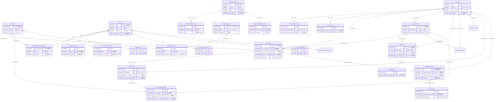

```mermaid
erDiagram
    %% =======================================================
    %% Core Masters: User, Device ID, SIM ID, Group
    %% =======================================================
    
    user_info {
        INTEGER id PK "ユーザーID"
        BYTES mail "メールアドレス"
        STRING user_name "ユーザー名"
        TIMESTAMP registdt "登録日時"
    }
    
    imei_info {
        INTEGER id PK "IMEI情報ID"
        STRING imei "IMEI"
        STRING iccid "ICCID"
    }

    imsi_info {
        INTEGER id PK "IMSI情報ID"
        STRING imsi "IMSI"
        STRING iccid "ICCID"
        TIMESTAMP expire "有効期限"
    }
    
    group_info {
        INTEGER id PK "グループ情報ID"
        STRING group_name "グループ名"
        INTEGER user_info_tblid FK "作成ユーザーID"
    }

    %% =======================================================
    %% Transactional / Mapping Tables
    %% =======================================================
    
    device_info {
        INTEGER id PK "デバイス情報ID"
        INTEGER imei_info_tblid FK "IMEI情報ID"
        INTEGER user_info_tblid FK "ユーザー情報ID"
        INTEGER group_info_tblid FK "グループ情報ID"
        STRING devicetype "デバイスタイプ"
    }
    
    translation_history {
        INTEGER id PK "翻訳履歴ID"
        INTEGER user_info_tblid FK "ユーザー情報ID"
        INTEGER device_info_tblid FK "デバイス情報ID"
        TIMESTAMP datetime "翻訳日時"
    }

    measured_value {
        INTEGER id PK "計測ID"
        STRING imei "IMEI"
        INTEGER total "合計時間"
        TIMESTAMP registdt "登録日時"
    }

    session_info {
        INTEGER id PK "セッションID"
        STRING sessionid "セッションID"
        INTEGER user_info_tblid FK "ユーザー情報ID"
        INTEGER device_info_tblid FK "デバイス情報ID"
    }
    
    message_master {
        INTEGER id PK "メッセージマスターID"
        STRING code "メッセージコード"
        STRING subject "件名"
    }

    folder_info {
        INTEGER id PK "フォルダ情報ID"
        STRING folder_name "フォルダ名"
        INTEGER group_info_tblid FK "グループ情報ID"
        INTEGER user_info_tblid FK "ユーザー情報ID"
    }
    
    %% =======================================================
    %% Detail / History / Utility Tables
    %% =======================================================
    
    access_token_info {
        INTEGER id PK "ID"
        STRING access_token "アクセストークン"
        INTEGER user_info_tblid FK "ユーザー情報ID"
    }
    
    account_lock {
        INTEGER id PK "ID"
        INTEGER user_info_tblid FK "ユーザー情報ID"
    }
    
    contracts_list {
        INTEGER id PK "ID"
        STRING imsi FK "IMSI"
    }

    extended_privilege_history {
        INTEGER imei_info_tblid FK "IMEI情報ID"
        STRING imsi FK "IMSI"
        TIMESTAMP registdt "登録日時"
    }

    imsi_expire_history {
        INTEGER id PK "ID"
        INTEGER infoid FK "IMSI情報ID"
        TIMESTAMP registdt "登録日時"
    }

    imsi_status_history {
        INTEGER id PK "ID"
        INTEGER infoid FK "IMSI情報ID"
        STRING before_status "変更前ステータス"
    }
    
    location_info {
        INTEGER id PK "ID"
        INTEGER translation_history_tblid FK "翻訳履歴ID"
        STRING wifimacaddress "WiFi MACアドレス"
    }

    measured_detail_value {
        INTEGER id PK "ID"
        INTEGER measured_id FK "計測ID"
        STRING api "使用されたAPI"
    }
    
    measured_translation_value {
        INTEGER id PK "ID"
        INTEGER measured_id FK "計測ID"
        STRING fromtext "原文"
    }
    
    message_setting {
        INTEGER id PK "ID"
        STRING imei FK "IMEI"
        INTEGER msg_master_id FK "メッセージマスターID"
    }

    product_regist_request {
        INTEGER id PK "ID"
        INTEGER imei_info_tblid FK "IMEI情報ID"
        INTEGER group_info_tblid FK "グループ情報ID"
        INTEGER session_info_tblid FK "セッション情報ID"
    }
    
    template_info {
        INTEGER id PK "ID"
        INTEGER folder_info_tblid FK "フォルダ情報ID"
    }
    
    sim_extension_history {
        INTEGER id PK "ID"
        STRING imsi FK "IMSI"
    }
    
    sim_terminate_history {
        INTEGER id PK "ID"
        STRING imsi FK "IMSI"
    }

    %% -----------------------------------------------------------
    %% Relationships
    %% -----------------------------------------------------------

    %% User Links
    user_info ||--o{ access_token_info : user_info_tblid
    user_info ||--o{ account_lock : user_info_tblid
    user_info ||--o{ device_info : user_info_tblid
    user_info ||--o{ group_info : user_info_tblid
    user_info ||--o{ folder_info : user_info_tblid
    user_info ||--o{ imei_bulk_register : user_info_tblid
    user_info ||--o{ onetime_url_info : user_info_tblid
    user_info ||--o{ session_info : user_info_tblid
    user_info ||--o{ translation_history : user_info_tblid

    %% Device/IMEI Links
    imei_info ||--o{ device_info : imei_info_tblid
    imei_info ||--o{ extended_privilege_history : imei_info_tblid
    imei_info ||--o{ product_regist_request : imei_info_tblid

    %% IMSI/SIM Links (using ID or IMSI string)
    imsi_info ||--o{ imsi_expire_history : infoid
    imsi_info ||--o{ imsi_status_history : infoid
    imsi_info }o--|| contracts_list : imsi
    imsi_info }o--|| extended_privilege_history : imsi
    imsi_info }o--|| sim_extension_history : imsi
    imsi_info }o--|| sim_terminate_history : imsi
    imsi_info }o--|| temp_traffic_csv_data_work : imsi

    %% Group Links
    group_info ||--o{ device_info : group_info_tblid
    group_info ||--o{ folder_info : group_info_tblid
    group_info ||--o{ imei_bulk_register : group_info_tblid
    group_info ||--o{ product_regist_request : group_info_tblid

    %% Transactional Links (History, Measurement, Session)
    translation_history ||--o{ location_info : translation_history_tblid
    device_info ||--o{ session_info : device_info_tblid
    device_info ||--o{ translation_history : device_info_tblid
    session_info ||--o{ product_regist_request : session_info_tblid

    %% Measurement Details
    measured_value ||--o{ measured_detail_value : measured_id
    measured_value ||--o{ measured_translation_value : measured_id
    
    %% Messaging
    message_master ||--o{ message_setting : msg_master_id
    
    %% Folders/Templates
    folder_info ||--o{ template_info : folder_info_tblid
    
    %% Other direct links (based on explicit FK descriptions, even if table content is minimal)
    imei_info }o--|| message_setting : imei
```