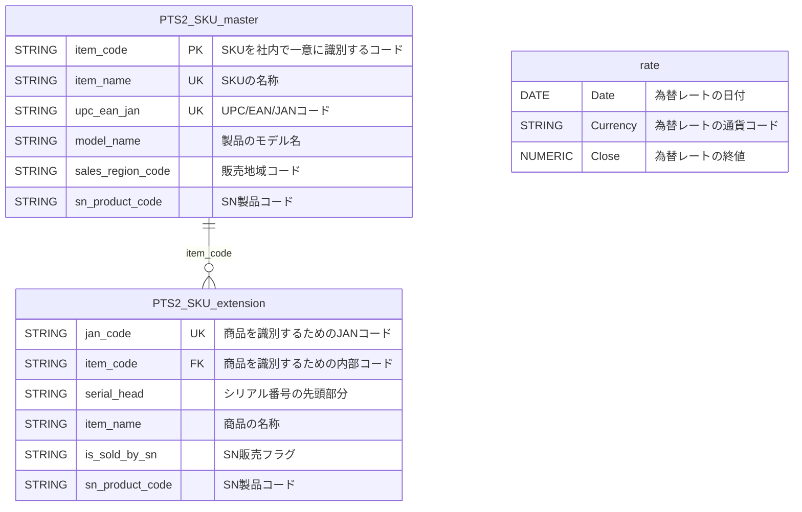

```mermaid
erDiagram
    %% =======================================================
    %% lake__pocketalk_device_master__prod Schema
    %% =======================================================
    
    PTS2_SKU_master {
        STRING item_code PK "SKUを社内で一意に識別するコード"
        STRING item_name UK "SKUの名称"
        STRING upc_ean_jan UK "UPC/EAN/JANコード"
        STRING model_name "製品のモデル名"
        STRING sales_region_code "販売地域コード"
        STRING sn_product_code "SN製品コード"
    }
    
    PTS2_SKU_extension {
        STRING jan_code UK "商品を識別するためのJANコード"
        STRING item_code FK "商品を識別するための内部コード"
        STRING serial_head "シリアル番号の先頭部分"
        STRING item_name "商品の名称"
        STRING is_sold_by_sn "SN販売フラグ"
        STRING sn_product_code "SN製品コード"
    }
    
    rate {
        DATE Date "為替レートの日付"
        STRING Currency "為替レートの通貨コード"
        NUMERIC Close "為替レートの終値"
    }
    
    %% -----------------------------------------------------------
    %% Relationships
    %% -----------------------------------------------------------
    
    PTS2_SKU_master ||--o{ PTS2_SKU_extension : item_code
```