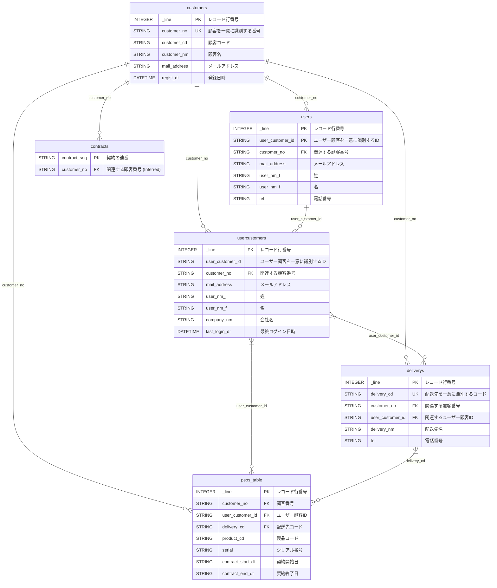

```mermaid
erDiagram
    %% =======================================================
    %% PSOS Schema (lake__psos__prod)
    %% =======================================================

    customers {
        INTEGER _line PK "レコード行番号"
        STRING customer_no UK "顧客を⼀意に識別する番号"
        STRING customer_cd "顧客コード"
        STRING customer_nm "顧客名"
        STRING mail_address "メールアドレス"
        DATETIME regist_dt "登録日時"
    }
    
    users {
        INTEGER _line PK "レコード行番号"
        STRING user_customer_id PK "ユーザー顧客を⼀意に識別するID"
        STRING customer_no FK "関連する顧客番号"
        STRING mail_address "メールアドレス"
        STRING user_nm_l "姓"
        STRING user_nm_f "名"
        STRING tel "電話番号"
    }
    
    usercustomers {
        INTEGER _line PK "レコード行番号"
        STRING user_customer_id "ユーザー顧客を⼀意に識別するID"
        STRING customer_no FK "関連する顧客番号"
        STRING mail_address "メールアドレス"
        STRING user_nm_l "姓"
        STRING user_nm_f "名"
        STRING company_nm "会社名"
        DATETIME last_login_dt "最終ログイン日時"
    }

    deliverys {
        INTEGER _line PK "レコード行番号"
        STRING delivery_cd UK "配送先を⼀意に識別するコード"
        STRING customer_no FK "関連する顧客番号"
        STRING user_customer_id FK "関連するユーザー顧客ID"
        STRING delivery_nm "配送先名"
        STRING tel "電話番号"
    }
    
    psos_table {
        INTEGER _line PK "レコード行番号"
        STRING customer_no FK "顧客番号"
        STRING user_customer_id FK "ユーザー顧客ID"
        STRING delivery_cd FK "配送先コード"
        STRING product_cd "製品コード"
        STRING serial "シリアル番号"
        STRING contract_start_dt "契約開始日"
        STRING contract_end_dt "契約終了日"
    }
    
    contracts {
        STRING contract_seq PK "契約の連番"
        STRING customer_no FK "関連する顧客番号 (Inferred)"
        %% Other contract details
    }

    %% -----------------------------------------------------------
    %% Relationships
    %% -----------------------------------------------------------

    %% Core Customer Links (1:N)
    customers ||--o{ users : customer_no
    customers ||--o{ usercustomers : customer_no
    customers ||--o{ deliverys : customer_no
    customers ||--o{ psos_table : customer_no
    
    %% User/Delivery Links (N:1/1:N)
    usercustomers }|--o{ deliverys : user_customer_id
    usercustomers }|--o{ psos_table : user_customer_id
    
    %% Users vs UserCustomers (Shared Key, likely representing different views of the same user)
    users ||--o{ usercustomers : user_customer_id
    
    %% Fact/Transaction Links
    deliverys }|--o{ psos_table : delivery_cd
    
    %% Contract Link (Inferred: Contracts should be tied to Customers)
    customers ||--o{ contracts : customer_no
```