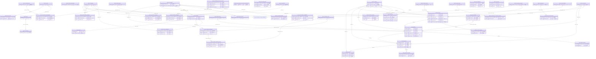

```mermaid
erDiagram
    %% =======================================================
    %% AAA: Authentication & Customer Core
    %% =======================================================
    
    ptpf_aaa_customers {
        INTEGER customer_id PK "顧客ID"
        STRING customer_type "顧客種別"
        STRING mailaddress UK "メールアドレス"
    }
    
    ptpf_aaa_accounts {
        INTEGER account_id PK "アカウントID"
        INTEGER customer_id FK "顧客ID"
        STRING user_code UK "ログインコード"
        STRING mailaddress UK "メールアドレス"
    }
    
    ptpf_aaa_customer_types {
        STRING customer_type_code PK "顧客種別コード"
    }
    
    ptpf_aaa_customer_properties {
        INTEGER customer_property_id PK "プロパティID"
        INTEGER customer_id FK "顧客ID"
        STRING key "属性キー"
    }

    ptpf_aaa_onetime_authenticates {
        INTEGER onetime_authenticate_id PK "ワンタイム認証ID"
    }
    
    ptpf_aaa_customer_type_multilinguals {
        INTEGER customer_type_multilingual_id PK "多言語ID"
        STRING customer_type_code FK "顧客種別コード"
        STRING language_code FK "言語コード"
    }

    %% =======================================================
    %% PLM: Product & License Management
    %% =======================================================
    
    ptpf_plm_products {
        STRING product_code PK "製品コード"
        STRING product_group_code FK "製品グループコード"
    }

    ptpf_plm_product_groups {
        STRING product_group_code PK "製品グループコード"
    }

    ptpf_plm_product_licenses {
        STRING product_license_code PK "製品ライセンスコード"
    }

    ptpf_plm_commodities {
        STRING commodity_code PK "商品コード"
        STRING payment_cycle_type_code FK "支払サイクル種別コード"
    }
    
    ptpf_plm_contracts {
        INTEGER contract_id PK "契約ID"
        INTEGER customer_id FK "顧客ID"
        STRING commodity_code FK "商品コード"
        STRING contract_status_code FK "契約ステータスコード"
        STRING currency_code FK "通貨コード"
        STRING payment_cycle_type_code FK "支払サイクル種別コード"
    }
    
    ptpf_plm_contract_statuses {
        STRING contract_status_code PK "契約ステータスコード"
    }

    ptpf_plm_contract_properties {
        INTEGER contract_property_id PK "契約属性ID"
        INTEGER contract_id FK "契約ID"
    }

    ptpf_plm_commodity_product_license_maps {
        INTEGER commodity_product_license_map_id PK "紐付ID"
        STRING commodity_code FK "商品コード"
        STRING product_code FK "製品コード"
        STRING product_license_code FK "製品ライセンスコード"
    }
    
    ptpf_plm_commodity_properties {
        INTEGER commodity_property_id PK "商品属性ID"
        STRING commodity_code FK "商品コード"
    }

    ptpf_plm_product_multilinguals {
        INTEGER product_multilingual_id PK "多言語ID"
        STRING product_code FK "製品コード"
        STRING language_code FK "言語コード"
    }
    
    ptpf_plm_commodity_multilinguals {
        INTEGER commodity_multilingual_id PK "多言語ID"
        STRING commodity_code FK "商品コード"
        STRING language_code FK "言語コード"
    }
    
    ptpf_plm_product_group_multilinguals {
        INTEGER product_group_multilingual_id PK "多言語ID"
        STRING product_group_code FK "製品グループコード"
        STRING language_code FK "言語コード"
    }
    
    ptpf_plm_tmp_change_price_contracts_with_sb000011 {
        INTEGER contract_id PK "契約ID"
    }
    
    %% =======================================================
    %% PYT: Payment & Billing
    %% =======================================================
    
    ptpf_pyt_billings {
        INTEGER billing_id PK "請求ID"
        INTEGER customer_id FK "顧客ID"
        INTEGER contract_id FK "契約ID"
        STRING commodity_code FK "商品コード"
        STRING billing_status_code FK "請求ステータスコード"
        STRING currency_code FK "通貨コード"
    }
    
    ptpf_pyt_billing_statuses {
        STRING billing_status_code PK "請求ステータスコード"
    }
    
    ptpf_pyt_billing_properties {
        INTEGER billing_property_id PK "請求属性ID"
        INTEGER billing_id FK "請求ID"
    }
    
    ptpf_pyt_payments {
        INTEGER payment_id PK "支払ID"
        INTEGER customer_id FK "顧客ID"
        INTEGER billing_id FK "請求ID"
        STRING currency_code FK "通貨コード"
    }

    ptpf_pyt_payment_properties {
        INTEGER payment_property_id PK "支払属性ID"
        INTEGER payment_id FK "支払ID"
    }

    ptpf_pyt_receipts {
        INTEGER receipt_id PK "領収書ID"
        INTEGER payment_id FK "支払ID"
        INTEGER customer_id FK "顧客ID"
    }

    ptpf_pyt_batch_billings {
        INTEGER batch_billing_id PK "一括請求ID"
        INTEGER customer_id FK "顧客ID"
        STRING currency_code FK "通貨コード"
    }
    
    ptpf_pyt_batch_billing_details {
        INTEGER batch_billing_detail_id PK "一括請求詳細ID"
        INTEGER batch_billing_id FK "一括請求ID"
        INTEGER billing_id FK "請求ID"
    }

    %% =======================================================
    %% CMN: Common Masters & Configuration
    %% =======================================================

    ptpf_cmn_languages {
        STRING language_code PK "言語コード"
    }
    
    ptpf_cmn_currencies {
        STRING currency_code PK "通貨コード"
    }
    
    ptpf_cmn_payment_cycle_types {
        STRING payment_cycle_type_code PK "支払サイクル種別コード"
    }

    ptpf_cmn_roles {
        INTEGER role_id PK "ロールID"
    }

    ptpf_cmn_authorities {
        INTEGER authority_id PK "権限ID"
    }

    ptpf_cmn_staffs {
        STRING staff_code PK "スタッフコード"
    }

    ptpf_cmn_role_authorities {
        INTEGER role_authority_id PK "ロール権限ID"
        INTEGER authority_id FK "権限ID"
        INTEGER role_id FK "ロールID"
    }

    ptpf_cmn_staff_roles {
        INTEGER staff_role_id PK "スタッフロールID"
        STRING staff_code FK "スタッフコード"
        INTEGER role_id FK "ロールID"
    }

    ptpf_cmn_lock_records {
        INTEGER lock_record_id PK "レコードロックID"
        STRING staff_code FK "スタッフコード"
    }
    
    ptpf_cmn_prefectures {
        INTEGER prefecture_id PK "都道府県ID"
    }

    ptpf_cmn_prefecture_multilinguals {
        INTEGER prefecture_multilingual_id PK "多言語ID"
        INTEGER prefecture_id FK "都道府県ID"
        STRING language_code FK "言語コード"
    }

    ptpf_cmn_webhook_events {
        STRING webhook_event_code PK "イベントコード"
    }
    
    ptpf_cmn_webhook_notifications {
        INTEGER webhook_notification_id PK "通知設定ID"
        STRING product_code FK "製品コード"
        STRING webhook_event_code FK "イベントコード"
    }

    ptpf_cmn_webhook_notification_queues {
        INTEGER webhook_notification_queue_id PK "キューID"
        INTEGER webhook_notification_id FK "通知設定ID"
        STRING webhook_event_code FK "イベントコード"
    }
    
    ptpf_cmn_payment_sites {
        STRING payment_site_code PK "支払サイトコード"
    }
    
    ptpf_cmn_payment_site_subscription_statuses {
        INTEGER payment_site_subscription_status_id PK "ステータスID"
        STRING payment_site_code FK "支払サイトコード"
    }
    
    ptpf_cmn_salts {
        INTEGER salt_id PK "ソルトID"
        STRING product_code FK "製品コード"
    }

    ptpf_cmn_batch_types {
        STRING batch_type_code PK "バッチ種別コード"
    }

    ptpf_cmn_batch_execute_histories {
        INTEGER batch_execute_history_id PK "実行履歴ID"
        STRING batch_type_code FK "バッチ種別コード"
    }
    
    ptpf_cmn_mail_templates {
        STRING mail_template_code PK "メールテンプレートコード"
    }
    
    ptpf_cmn_mail_template_multilinguals {
        INTEGER mail_template_multilingual_id PK "多言語ID"
        STRING mail_template_code FK "メールテンプレートコード"
        STRING language_code FK "言語コード"
    }


    %% -----------------------------------------------------------
    %% Relationships Definitions
    %% -----------------------------------------------------------
    
    %% AAA Core
    ptpf_aaa_customers ||--o{ ptpf_aaa_accounts : customer_id
    ptpf_aaa_customers ||--o{ ptpf_aaa_customer_properties : customer_id
    ptpf_aaa_customer_types ||--o{ ptpf_aaa_customer_type_multilinguals : customer_type_code

    %% PLM Core Product/Commodity Hierarchy
    ptpf_plm_product_groups ||--o{ ptpf_plm_products : product_group_code
    ptpf_plm_products ||--o{ ptpf_plm_product_multilinguals : product_code
    ptpf_plm_commodities ||--o{ ptpf_plm_commodity_multilinguals : commodity_code
    ptpf_plm_commodities ||--o{ ptpf_plm_commodity_properties : commodity_code
    ptpf_plm_commodities }o--o{ ptpf_plm_product_licenses : "N:M via commodity_product_license_maps"
    ptpf_plm_commodities }o--o{ ptpf_plm_products : "N:M via commodity_product_license_maps"
    
    %% Contract Core
    ptpf_aaa_customers ||--o{ ptpf_plm_contracts : customer_id
    ptpf_plm_commodities ||--o{ ptpf_plm_contracts : commodity_code
    ptpf_plm_contract_statuses ||--o{ ptpf_plm_contracts : contract_status_code
    ptpf_cmn_currencies ||--o{ ptpf_plm_contracts : currency_code
    ptpf_cmn_payment_cycle_types ||--o{ ptpf_plm_contracts : payment_cycle_type_code
    ptpf_plm_contracts ||--o{ ptpf_plm_contract_properties : contract_id
    
    %% PYT Billing/Payment/Receipt
    ptpf_plm_contracts ||--o{ ptpf_pyt_billings : contract_id
    ptpf_aaa_customers ||--o{ ptpf_pyt_billings : customer_id
    ptpf_plm_commodities ||--o{ ptpf_pyt_billings : commodity_code
    ptpf_pyt_billing_statuses ||--o{ ptpf_pyt_billings : billing_status_code
    ptpf_cmn_currencies ||--o{ ptpf_pyt_billings : currency_code
    ptpf_pyt_billings ||--o{ ptpf_pyt_billing_properties : billing_id
    
    ptpf_pyt_billings ||--o{ ptpf_pyt_payments : billing_id
    ptpf_aaa_customers ||--o{ ptpf_pyt_payments : customer_id
    ptpf_cmn_currencies ||--o{ ptpf_pyt_payments : currency_code
    ptpf_pyt_payments ||--o{ ptpf_pyt_payment_properties : payment_id
    
    ptpf_pyt_payments ||--o{ ptpf_pyt_receipts : payment_id
    ptpf_aaa_customers ||--o{ ptpf_pyt_receipts : customer_id
    
    %% PYT Batch Billing
    ptpf_aaa_customers ||--o{ ptpf_pyt_batch_billings : customer_id
    ptpf_cmn_currencies ||--o{ ptpf_pyt_batch_billings : currency_code
    ptpf_pyt_batch_billings }o--o{ ptpf_pyt_billings : "N:M via batch_billing_details"

    %% CMN Authority/Staff/Roles
    ptpf_cmn_roles }o--o{ ptpf_cmn_authorities : "N:M via role_authorities"
    ptpf_cmn_staffs }o--o{ ptpf_cmn_roles : "N:M via staff_roles"
    ptpf_cmn_staffs ||--o{ ptpf_cmn_lock_records : staff_code

    %% CMN Multilingual Links
    ptpf_cmn_languages ||--o{ ptpf_aaa_customer_type_multilinguals : language_code
    ptpf_cmn_languages ||--o{ ptpf_plm_product_multilinguals : language_code
    ptpf_cmn_languages ||--o{ ptpf_plm_commodity_multilinguals : language_code
    ptpf_cmn_languages ||--o{ ptpf_plm_product_group_multilinguals : language_code
    ptpf_cmn_languages ||--o{ ptpf_cmn_prefecture_multilinguals : language_code
    ptpf_cmn_languages ||--o{ ptpf_cmn_mail_template_multilinguals : language_code
    ptpf_cmn_prefectures ||--o{ ptpf_cmn_prefecture_multilinguals : prefecture_id
    ptpf_cmn_payment_cycle_types ||--o{ ptpf_cmn_payment_cycle_type_multilinguals : payment_cycle_type_code
    ptpf_cmn_languages ||--o{ ptpf_cmn_payment_cycle_type_multilinguals : language_code
    ptpf_cmn_mail_templates ||--o{ ptpf_cmn_mail_template_multilinguals : mail_template_code
    
    %% CMN Webhooks/Batch/Salts
    ptpf_plm_products ||--o{ ptpf_cmn_webhook_notifications : product_code
    ptpf_cmn_webhook_events ||--o{ ptpf_cmn_webhook_notifications : webhook_event_code
    ptpf_cmn_webhook_notifications ||--o{ ptpf_cmn_webhook_notification_queues : webhook_notification_id
    ptpf_cmn_webhook_events ||--o{ ptpf_cmn_webhook_notification_queues : webhook_event_code
    ptpf_plm_products ||--o{ ptpf_cmn_salts : product_code
    ptpf_cmn_batch_types ||--o{ ptpf_cmn_batch_execute_histories : batch_type_code
    ptpf_cmn_payment_sites ||--o{ ptpf_cmn_payment_site_subscription_statuses : payment_site_code
```