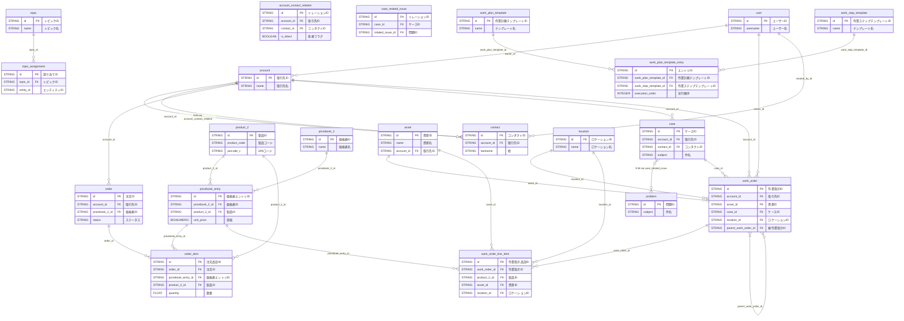

```mermaid
erDiagram
    %% =======================================================
    %% Core Entities (CRM & Master)
    %% =======================================================

    user {
        STRING id PK "ユーザーID"
        STRING username "ユーザー名"
    }
    
    account {
        STRING id PK "取引先ID"
        STRING name "取引先名"
    }

    contact {
        STRING id PK "コンタクトID"
        STRING account_id FK "取引先ID"
        STRING lastname "姓"
    }
    
    product_2 {
        STRING id PK "製品ID"
        STRING product_code "製品コード"
        STRING jancode_c "JANコード"
    }
    
    pricebook_2 {
        STRING id PK "価格表ID"
        STRING name "価格表名"
    }
    
    pricebook_entry {
        STRING id PK "価格表エントリID"
        STRING pricebook_2_id FK "価格表ID"
        STRING product_2_id FK "製品ID"
        BIGNUMERIC unit_price "単価"
    }

    asset {
        STRING id PK "資産ID"
        STRING name "資産名"
        STRING account_id FK "取引先ID"
    }

    case {
        STRING id PK "ケースID"
        STRING account_id FK "取引先ID"
        STRING contact_id FK "コンタクトID"
        STRING subject "件名"
    }

    problem {
        STRING id PK "問題ID"
        STRING subject "件名"
    }
    
    location {
        STRING id PK "ロケーションID"
        STRING name "ロケーション名"
    }
    
    order {
        STRING id PK "注文ID"
        STRING account_id FK "取引先ID"
        STRING pricebook_2_id FK "価格表ID"
        STRING status "ステータス"
    }

    work_order {
        STRING id PK "作業指示ID"
        STRING account_id FK "取引先ID"
        STRING asset_id FK "資産ID"
        STRING case_id FK "ケースID"
        STRING location_id FK "ロケーションID"
        STRING parent_work_order_id FK "親作業指示ID"
    }

    
    %% =======================================================
    %% Junctions & Details (M:N, Items, History)
    %% =======================================================
    
    account_contact_relation {
        STRING id PK "リレーションID"
        STRING account_id FK "取引先ID"
        STRING contact_id FK "コンタクトID"
        BOOLEAN is_direct "直接フラグ"
    }

    order_item {
        STRING id PK "注文品目ID"
        STRING order_id FK "注文ID"
        STRING pricebook_entry_id FK "価格表エントリID"
        STRING product_2_id FK "製品ID"
        FLOAT quantity "数量"
    }
    
    work_order_line_item {
        STRING id PK "作業指示品目ID"
        STRING work_order_id FK "作業指示ID"
        STRING product_2_id FK "製品ID"
        STRING asset_id FK "資産ID"
        STRING location_id FK "ロケーションID"
    }

    case_related_issue {
        STRING id PK "リレーションID"
        STRING case_id FK "ケースID"
        STRING related_issue_id FK "問題ID"
    }

    topic {
        STRING id PK "トピックID"
        STRING name "トピック名"
    }
    
    topic_assignment {
        STRING id PK "割り当てID"
        STRING topic_id FK "トピックID"
        STRING entity_id "エンティティID"
    }

    %% =======================================================
    %% Templates & Metadata (Field Service / Customization)
    %% =======================================================
    
    work_plan_template {
        STRING id PK "作業計画テンプレートID"
        STRING name "テンプレート名"
    }

    work_step_template {
        STRING id PK "作業ステップテンプレートID"
        STRING name "テンプレート名"
    }

    work_plan_template_entry {
        STRING id PK "エントリID"
        STRING work_plan_template_id FK "作業計画テンプレートID"
        STRING work_step_template_id FK "作業ステップテンプレートID"
        INTEGER execution_order "実行順序"
    }
    
    
    %% -----------------------------------------------------------
    %% Relationships Mapping (Based on FK definitions and common IDs)
    %% -----------------------------------------------------------

    %% Core Sales/CRM Structure
    account ||--o{ contact : account_id
    account }o--o{ contact : "N:M via account_contact_relation"
    account ||--o{ order : account_id
    account ||--o{ case : account_id
    account ||--o{ work_order : account_id
    
    %% Sales & Pricing
    pricebook_2 ||--o{ pricebook_entry : pricebook_2_id
    product_2 ||--o{ pricebook_entry : product_2_id
    order ||--o{ order_item : order_id
    pricebook_entry ||--o{ order_item : pricebook_entry_id
    product_2 ||--o{ order_item : product_2_id

    %% Service (Case, Problem, Work Order)
    case }o--o{ problem : "N:M via case_related_issue"
    case ||--o{ work_order : case_id
    asset ||--o{ work_order : asset_id
    location ||--o{ work_order : location_id
    work_order ||--o{ work_order_line_item : work_order_id
    asset ||--o{ work_order_line_item : asset_id
    location ||--o{ work_order_line_item : location_id
    pricebook_entry ||--o{ work_order_line_item : pricebook_entry_id

    %% Field Service Templates
    work_plan_template ||--o{ work_plan_template_entry : work_plan_template_id
    work_step_template ||--o{ work_plan_template_entry : work_step_template_id

    %% Chatter / Topics
    topic ||--o{ topic_assignment : topic_id
    
    %% Hierarchy (Self-Reference)
    work_order }|--o{ work_order : parent_work_order_id
    
    %% Universal Audit & Ownership (Illustrative, user.id links to CreatedById, LastModifiedById, OwnerId, etc. in almost every table)
    user ||--o{ account : owner_id
    user ||--o{ work_order : owner_id
    user ||--o{ contact : created_by_id
```