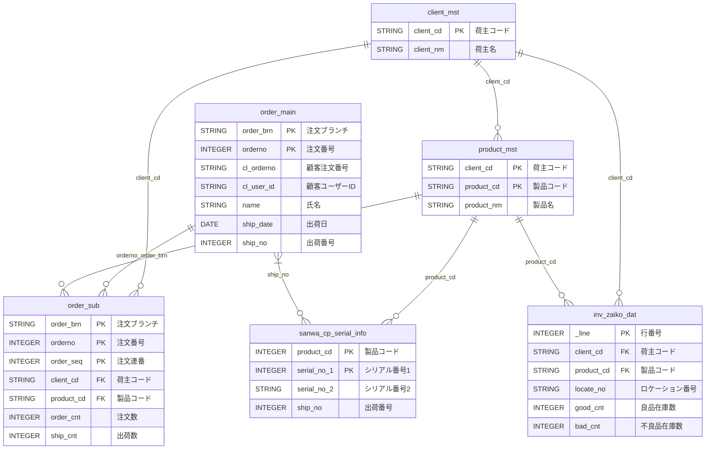

```mermaid
erDiagram
    %% =======================================================
    %% Core Masters: Client and Product
    %% =======================================================

    client_mst {
        STRING client_cd PK "荷主コード"
        STRING client_nm "荷主名"
    }

    product_mst {
        STRING client_cd PK "荷主コード"
        STRING product_cd PK "製品コード"
        STRING product_nm "製品名"
    }
    
    %% =======================================================
    %% Transactional Tables: Order, Inventory, Serial
    %% =======================================================

    order_main {
        STRING order_brn PK "注文ブランチ"
        INTEGER orderno PK "注文番号"
        STRING cl_orderno "顧客注文番号"
        STRING cl_user_id "顧客ユーザーID"
        STRING name "氏名"
        DATE ship_date "出荷日"
        INTEGER ship_no "出荷番号"
    }

    order_sub {
        STRING order_brn PK "注文ブランチ"
        INTEGER orderno PK "注文番号"
        INTEGER order_seq PK "注文連番"
        STRING client_cd FK "荷主コード"
        STRING product_cd FK "製品コード"
        INTEGER order_cnt "注文数"
        INTEGER ship_cnt "出荷数"
    }

    inv_zaiko_dat {
        INTEGER _line PK "行番号"
        STRING client_cd FK "荷主コード"
        STRING product_cd FK "製品コード"
        STRING locate_no "ロケーション番号"
        INTEGER good_cnt "良品在庫数"
        INTEGER bad_cnt "不良品在庫数"
    }
    
    sanwa_cp_serial_info {
        INTEGER product_cd PK "製品コード"
        INTEGER serial_no_1 PK "シリアル番号1"
        STRING serial_no_2 "シリアル番号2"
        INTEGER ship_no "出荷番号"
    }

    %% -----------------------------------------------------------
    %% Relationships
    %% -----------------------------------------------------------

    %% Client Master Links
    client_mst ||--o{ product_mst : client_cd
    client_mst ||--o{ order_sub : client_cd
    client_mst ||--o{ inv_zaiko_dat : client_cd

    %% Order Links
    order_main ||--o{ order_sub : orderno_order_brn

    %% Product Links
    product_mst ||--o{ order_sub : product_cd
    product_mst ||--o{ inv_zaiko_dat : product_cd
    product_mst ||--o{ sanwa_cp_serial_info : product_cd
    
    %% Implicit Link: Order to Serial Info (via ship_no)
    order_main }|--o{ sanwa_cp_serial_info : ship_no
```