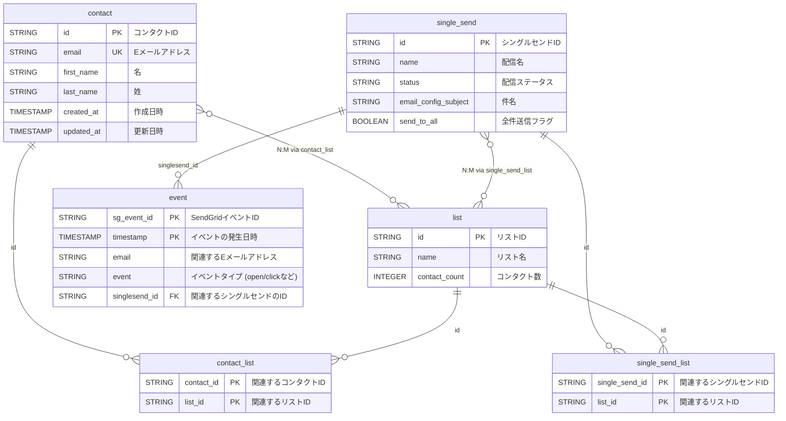

```mermaid
erDiagram
    %% =======================================================
    %% Core Masters
    %% =======================================================
    
    contact {
        STRING id PK "コンタクトID"
        STRING email UK "Eメールアドレス"
        STRING first_name "名"
        STRING last_name "姓"
        TIMESTAMP created_at "作成日時"
        TIMESTAMP updated_at "更新日時"
    }
    
    list {
        STRING id PK "リストID"
        STRING name "リスト名"
        INTEGER contact_count "コンタクト数"
    }
    
    single_send {
        STRING id PK "シングルセンドID"
        STRING name "配信名"
        STRING status "配信ステータス"
        STRING email_config_subject "件名"
        BOOLEAN send_to_all "全件送信フラグ"
    }

    %% =======================================================
    %% Junction Tables (N:M Relationships)
    %% =======================================================
    
    contact_list {
        STRING contact_id PK "関連するコンタクトID"
        STRING list_id PK "関連するリストID"
    }
    
    single_send_list {
        STRING single_send_id PK "関連するシングルセンドID"
        STRING list_id PK "関連するリストID"
    }
    
    %% =======================================================
    %% Transactional Tables
    %% =======================================================
    
    event {
        STRING sg_event_id PK "SendGridイベントID"
        TIMESTAMP timestamp PK "イベントの発生日時"
        STRING email "関連するEメールアドレス"
        STRING event "イベントタイプ (open/clickなど)"
        STRING singlesend_id FK "関連するシングルセンドのID"
    }
    
    %% -----------------------------------------------------------
    %% Relationships
    %% -----------------------------------------------------------
    
    %% N:M Relations between Contacts and Lists
    contact }o--o{ list : "N:M via contact_list"
    contact ||--o{ contact_list : id
    list ||--o{ contact_list : id
    
    %% N:M Relations between Single Sends and Lists
    single_send }o--o{ list : "N:M via single_send_list"
    single_send ||--o{ single_send_list : id
    list ||--o{ single_send_list : id
    
    %% Single Send to Event Log (1:N)
    single_send ||--o{ event : singlesend_id
```