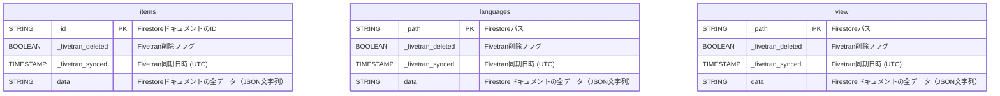

```mermaid
erDiagram
    %% =======================================================
    %% lake__sentio_gcp_firestore__prod Schema Analysis
    %% NOTE: Relationships cannot be inferred as application data
    %% (potential foreign keys) are embedded within the 'data' column.
    %% =======================================================
    
    items {
        STRING _id PK "FirestoreドキュメントのID"
        BOOLEAN _fivetran_deleted "Fivetran削除フラグ"
        TIMESTAMP _fivetran_synced "Fivetran同期日時 (UTC)"
        STRING data "Firestoreドキュメントの全データ（JSON文字列）"
    }
    
    languages {
        STRING _path PK "Firestoreパス"
        BOOLEAN _fivetran_deleted "Fivetran削除フラグ"
        TIMESTAMP _fivetran_synced "Fivetran同期日時 (UTC)"
        STRING data "Firestoreドキュメントの全データ（JSON文字列）"
    }
    
    view {
        STRING _path PK "Firestoreパス"
        BOOLEAN _fivetran_deleted "Fivetran削除フラグ"
        TIMESTAMP _fivetran_synced "Fivetran同期日時 (UTC)"
        STRING data "Firestoreドキュメントの全データ（JSON文字列）"
    }
    
    %% -----------------------------------------------------------
    %% Relationships (None inferred within this schema)
    %% -----------------------------------------------------------
```