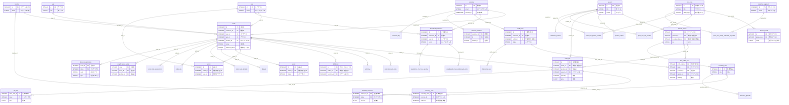

```mermaid
erDiagram
    %% =======================================================
    %% Core Entities
    %% =======================================================
    
    user {
        INTEGER id PK "ユーザーID"
        STRING email "Eメールアドレス"
    }

    customer {
        INTEGER id PK "顧客ID"
        STRING email "Eメールアドレス"
        TIMESTAMP created_at "作成日時"
    }

    product {
        INTEGER id PK "製品ID"
        STRING title "タイトル"
        STRING vendor "ベンダー"
    }
    
    product_variant {
        INTEGER id PK "バリアントID"
        INTEGER product_id FK "関連する製品ID"
        INTEGER inventory_item_id FK "関連する在庫商品ID"
        STRING sku "SKU"
    }
    
    inventory_item {
        INTEGER id PK "在庫商品ID"
        STRING sku "SKU"
    }
    
    location {
        INTEGER id PK "ロケーションID"
        STRING name "ロケーション名"
    }

    price_rule {
        INTEGER id PK "価格ルールID"
        STRING title "タイトル"
        STRING value_type "割引値タイプ"
    }

    app {
        INTEGER id PK "アプリID"
        STRING title "タイトル"
    }

    customer_segment {
        INTEGER id PK "セグメントID"
        STRING name "セグメント名"
    }

    %% =======================================================
    %% Transactional Headers
    %% =======================================================
    
    order {
        INTEGER id PK "注文ID"
        INTEGER customer_id FK "顧客ID"
        INTEGER user_id FK "ユーザーID"
        INTEGER app_id FK "アプリID"
        INTEGER location_id FK "ロケーションID"
        STRING name "注文名"
        STRING financial_status "財務ステータス"
    }
    
    draft_order {
        INTEGER id PK "下書き注文ID"
        INTEGER customer_id FK "顧客ID"
        INTEGER order_id FK "作成された注文ID"
        STRING status "ステータス"
    }

    abandoned_checkout {
        INTEGER id PK "カゴ落ちID"
        INTEGER customer_id FK "顧客ID"
        INTEGER user_id FK "ユーザーID"
        STRING email "Eメールアドレス"
    }

    fulfillment {
        INTEGER id PK "フルフィルメントID"
        INTEGER order_id FK "関連する注文ID"
        INTEGER location_id FK "ロケーションID"
    }
    
    refund {
        INTEGER id PK "返金ID"
        INTEGER order_id FK "関連する注文ID"
        INTEGER user_id FK "処理ユーザーID"
    }

    return {
        INTEGER id PK "返品ID"
        INTEGER order_id FK "関連する注文ID"
        STRING status "ステータス"
    }

    %% =======================================================
    %% Transactional Lines and Details
    %% =======================================================

    order_line {
        INTEGER id PK "注文明細ID"
        INTEGER order_id FK "関連する注文ID"
        INTEGER product_id FK "製品ID"
        INTEGER variant_id FK "バリアントID"
        INTEGER quantity "数量"
        FLOAT price "単価"
    }

    draft_order_line {
        INTEGER draft_order_id PK "下書き注文ID"
        INTEGER index PK "インデックス"
        INTEGER product_id FK "製品ID"
        INTEGER variant_id FK "バリアントID"
        INTEGER quantity "数量"
    }
    
    inventory_level {
        INTEGER inventory_item_id PK "在庫商品ID"
        INTEGER location_id PK "ロケーションID"
        INTEGER available "利用可能在庫数"
    }
    
    discount_allocation {
        INTEGER order_line_id PK "注文明細ID"
        INTEGER index PK "インデックス"
        FLOAT amount "割引額"
    }

    discount_application {
        INTEGER order_id PK "注文ID"
        INTEGER index PK "インデックス"
        STRING code "割引コード"
        STRING type "割引のタイプ"
    }
    
    discount_code {
        INTEGER id PK "割引コードID"
        INTEGER price_rule_id FK "価格ルールID"
        STRING code "割引コード文字列"
    }

    shopify_order_serial {
        INTEGER _line PK "行番号"
        INTEGER order_id FK "注文ID"
        INTEGER product_id FK "製品ID"
    }
    
    customer_address {
        INTEGER customer_id PK "顧客ID"
        INTEGER id PK "住所ID"
        STRING address_1 "住所1"
    }

    tax_line {
        INTEGER order_line_id PK "注文明細ID"
        INTEGER index PK "インデックス"
        FLOAT rate "税率"
    }

    %% -----------------------------------------------------------
    %% Relationships Mapping
    %% -----------------------------------------------------------
    
    %% Core Relationships
    user ||--o{ order : user_id
    user ||--o{ abandoned_checkout : user_id
    user ||--o{ refund : user_id
    
    customer ||--o{ order : customer_id
    customer ||--o{ abandoned_checkout : customer_id
    customer ||--o{ draft_order : customer_id
    customer ||--o{ customer_address : customer_id
    customer ||--o{ customer_tag : customer_id

    %% Order Flow
    app ||--o{ order : app_id
    location ||--o{ order : location_id
    order ||--o{ order_line : order_id
    order ||--o{ order_discount_code : order_id
    order ||--o{ order_tag : order_id
    order ||--o{ fulfillment : order_id
    order ||--o{ refund : order_id
    order ||--o{ return : order_id
    order ||--o{ dispute : order_id
    order ||--o{ order_note_attribute : order_id
    order ||--o{ order_risk : order_id
    order ||--o{ order_risk_assessment : order_id
    order ||--o{ shopify_order_serial : order_id

    %% Product & Inventory
    product ||--o{ product_variant : product_id
    product ||--o{ product_option : product_id
    product ||--o{ order_line : product_id
    product ||--o{ collection_product : product_id
    product_variant ||--o{ order_line : variant_id
    product_variant ||--o{ draft_order_line : variant_id
    
    product_variant ||--o{ inventory_item : inventory_item_id
    inventory_item }|--o{ inventory_level : inventory_item_id
    inventory_item ||--o{ inventory_quantity : inventory_item_id
    location }|--o{ inventory_level : location_id
    
    %% Lines and Details
    order_line ||--o{ discount_allocation : order_line_id
    order_line ||--o{ tax_line : order_line_id
    order ||--o{ discount_application : order_id
    
    draft_order ||--o{ draft_order_line : draft_order_id
    draft_order ||--o{ draft_order_tag : draft_order_id
    
    abandoned_checkout ||--o{ abandoned_checkout_discount_code : checkout_id
    abandoned_checkout ||--o{ abandoned_checkout_tax_line : checkout_id

    %% Discount/Price Rules
    price_rule ||--o{ discount_code : price_rule_id
    price_rule ||--o{ price_rule_ent_product : price_rule_id
    price_rule ||--o{ price_rule_prereq_product : price_rule_id
    price_rule ||--o{ price_rule_prereq_customer_segment : price_rule_id
    
    product ||--o{ price_rule_ent_product : product_id
    product ||--o{ price_rule_prereq_product : product_id
    customer_segment ||--o{ price_rule_prereq_customer_segment : segment_id
```