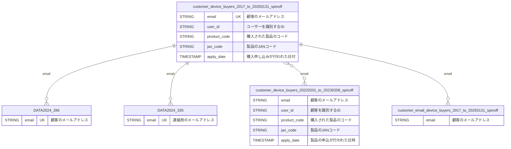

```mermaid
erDiagram
    %% =======================================================
    %% lake__snec__prod Schema Analysis
    %% NOTE: Relationships are inferred based on common keys (email, user_id, product_code)
    %% as these tables appear to be specialized reports or lists.
    %% =======================================================
    
    customer_device_buyers_2017_to_20250131_spinoff {
        STRING email UK "顧客のメールアドレス"
        STRING user_id "ユーザーを識別するID"
        STRING product_code "購入された製品のコード"
        STRING jan_code "製品のJANコード"
        TIMESTAMP apply_date "購入申し込みが行われた日付"
    }

    customer_device_buyers_20220201_to_20230208_spinoff {
        STRING email "顧客のメールアドレス"
        STRING user_id "顧客を識別するID"
        STRING product_code "購入された製品のコード"
        STRING jan_code "製品のJANコード"
        TIMESTAMP apply_date "製品の申込が行われた日時"
    }

    DATA2024_286 {
        STRING email UK "顧客のメールアドレス"
    }
    
    DATA2024_335 {
        STRING email UK "連絡用のメールアドレス"
    }
    
    customer_email_device_buyers_2017_to_20250131_spinoff {
        STRING email "顧客のメールアドレス"
    }
    
    %% -----------------------------------------------------------
    %% Relationships (Inferred by shared key: email)
    %% -----------------------------------------------------------
    
    %% Buyers lists share common attributes and represent subsets/supersets of contacts
    customer_device_buyers_2017_to_20250131_spinoff ||--o{ DATA2024_286 : email
    customer_device_buyers_2017_to_20250131_spinoff ||--o{ DATA2024_335 : email
    
    %% The two main buyer lists overlap in data domains
    customer_device_buyers_2017_to_20250131_spinoff }o--o{ customer_device_buyers_20220201_to_20230208_spinoff : email
    
    %% Buyer list (Long term) likely feeds the derived email list
    customer_device_buyers_2017_to_20250131_spinoff ||--o{ customer_email_device_buyers_2017_to_20250131_spinoff : email
```