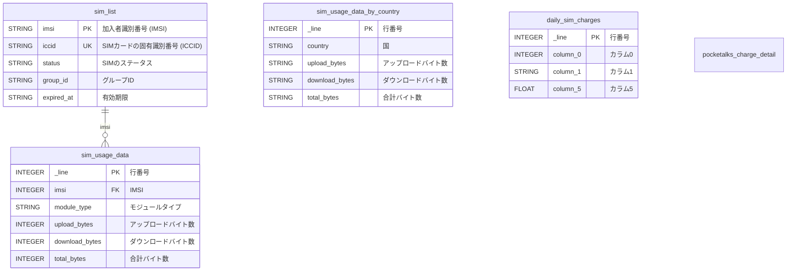

```mermaid
erDiagram
    %% =======================================================
    %% Soracom Drive Core SIM Management
    %% =======================================================

    sim_list {
        STRING imsi PK "加入者識別番号 (IMSI)"
        STRING iccid UK "SIMカードの固有識別番号 (ICCID)"
        STRING status "SIMのステータス"
        STRING group_id "グループID"
        STRING expired_at "有効期限"
    }

    sim_usage_data {
        INTEGER _line PK "行番号"
        INTEGER imsi FK "IMSI"
        STRING module_type "モジュールタイプ"
        INTEGER upload_bytes "アップロードバイト数"
        INTEGER download_bytes "ダウンロードバイト数"
        INTEGER total_bytes "合計バイト数"
    }

    %% =======================================================
    %% Reporting & Charges (Isolated Tables)
    %% =======================================================

    sim_usage_data_by_country {
        INTEGER _line PK "行番号"
        STRING country "国"
        STRING upload_bytes "アップロードバイト数"
        STRING download_bytes "ダウンロードバイト数"
        STRING total_bytes "合計バイト数"
    }
    
    daily_sim_charges {
        INTEGER _line PK "行番号"
        INTEGER column_0 "カラム0"
        STRING column_1 "カラム1"
        FLOAT column_5 "カラム5"
    }
    
    pocketalks_charge_detail {
        %% Definition details not fully provided in source
    }

    %% -----------------------------------------------------------
    %% Relationships
    %% -----------------------------------------------------------

    sim_list ||--o{ sim_usage_data : imsi
```