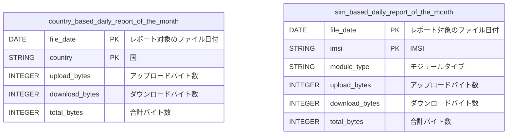

```mermaid
erDiagram
    %% =======================================================
    %% SORACOM SLACK REPORTS (lake__soracom_slack__prod)
    %% Note: These tables are parallel daily usage reports 
    %% and do not have internal relationships based on shared FKs.
    %% =======================================================
    
    country_based_daily_report_of_the_month {
        DATE file_date PK "レポート対象のファイル日付"
        STRING country PK "国"
        INTEGER upload_bytes "アップロードバイト数"
        INTEGER download_bytes "ダウンロードバイト数"
        INTEGER total_bytes "合計バイト数"
    }
    
    sim_based_daily_report_of_the_month {
        DATE file_date PK "レポート対象のファイル日付"
        STRING imsi PK "IMSI"
        STRING module_type "モジュールタイプ"
        INTEGER upload_bytes "アップロードバイト数"
        INTEGER download_bytes "ダウンロードバイト数"
        INTEGER total_bytes "合計バイト数"
    }
```