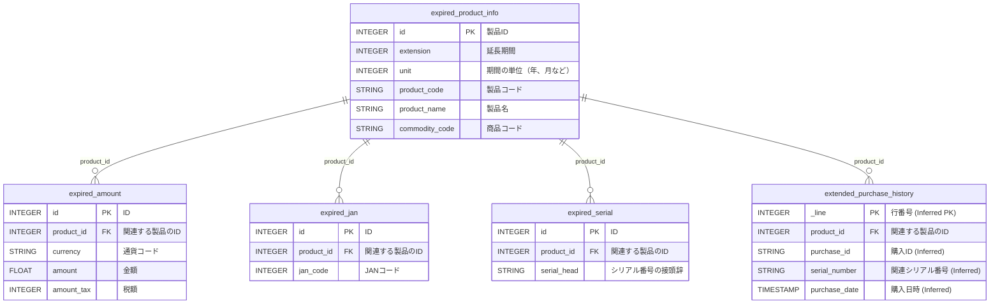

```mermaid
erDiagram
    %% =======================================================
    %% STPAY Extended Warranty Schema (lake__stpay_aws_rds__prod)
    %% =======================================================

    expired_product_info {
        INTEGER id PK "製品ID"
        INTEGER extension "延長期間"
        INTEGER unit "期間の単位（年、月など）"
        STRING product_code "製品コード"
        STRING product_name "製品名"
        STRING commodity_code "商品コード"
    }
    
    expired_amount {
        INTEGER id PK "ID"
        INTEGER product_id FK "関連する製品のID"
        STRING currency "通貨コード"
        FLOAT amount "金額"
        INTEGER amount_tax "税額"
    }

    expired_jan {
        INTEGER id PK "ID"
        INTEGER product_id FK "関連する製品のID"
        INTEGER jan_code "JANコード"
    }
    
    expired_serial {
        INTEGER id PK "ID"
        INTEGER product_id FK "関連する製品のID"
        STRING serial_head "シリアル番号の接頭辞"
    }

    extended_purchase_history {
        INTEGER _line PK "行番号 (Inferred PK)"
        INTEGER product_id FK "関連する製品のID"
        STRING purchase_id "購入ID (Inferred)"
        STRING serial_number "関連シリアル番号 (Inferred)"
        TIMESTAMP purchase_date "購入日時 (Inferred)"
    }

    %% -----------------------------------------------------------
    %% Relationships
    %% -----------------------------------------------------------

    %% Core Product Info links to related masters
    expired_product_info ||--o{ expired_amount : product_id
    expired_product_info ||--o{ expired_jan : product_id
    expired_product_info ||--o{ expired_serial : product_id
    
    %% Purchase history tracks purchases related to the product info
    expired_product_info ||--o{ extended_purchase_history : product_id
```