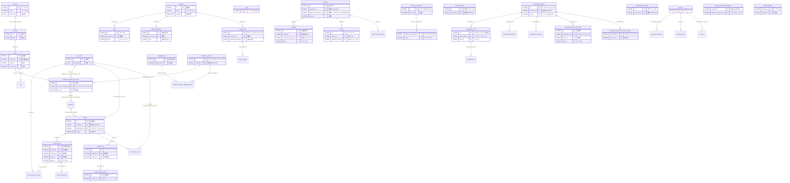

```mermaid
erDiagram
    %% =======================================================
    %% Core Masters: Customer, Account, Product, Pricing
    %% =======================================================
    
    customer {
        STRING id PK "顧客ID"
        STRING email "メールアドレス"
        TIMESTAMP created "作成日時"
    }

    account {
        STRING id PK "アカウントID"
    }
    
    product {
        STRING id PK "製品ID"
        STRING name "製品名"
    }
    
    price {
        STRING id PK "価格ID"
        STRING product_id FK "関連製品ID"
        STRING currency "通貨"
        INTEGER unit_amount "単価"
    }

    plan {
        STRING id PK "プランID (Legacy)"
    }
    
    coupon {
        STRING id PK "クーポンID"
        STRING name "クーポン名"
        FLOAT percent_off "割引率"
    }

    tax_rate {
        STRING id PK "税率ID"
        FLOAT percentage "税率（%）"
    }
    
    payment_method {
        STRING id PK "支払方法ID"
        STRING customer_id FK "顧客ID"
        STRING type "支払方法タイプ"
    }

    card {
        STRING id PK "カードID"
        STRING customer_id FK "顧客ID"
        STRING brand "カードブランド"
    }

    shipping_rate {
        STRING id PK "配送料金ID"
        STRING display_name "表示名"
    }
    
    %% =======================================================
    %% Transactional Headers
    %% =======================================================
    
    charge {
        STRING id PK "支払いID"
        STRING customer_id FK "顧客ID (Inferred)"
        STRING balance_transaction_id FK "残高トランザクションID (Inferred)"
        INTEGER amount "金額"
    }
    
    invoice {
        STRING id PK "請求書ID"
        STRING customer_id FK "顧客ID (Inferred)"
        STRING subscription_id FK "サブスクリプションID"
        TIMESTAMP created "作成日時"
    }

    credit_note {
        STRING id PK "クレジットノートID"
        STRING customer_id FK "顧客ID"
        STRING invoice_id FK "請求書ID"
    }
    
    dispute {
        STRING id PK "不審請求ID"
        STRING charge_id FK "関連支払いID"
        STRING connected_account_id FK "接続アカウントID"
        STRING status "ステータス"
    }
    
    review {
        STRING id PK "レビューID"
        STRING charge_id FK "支払いID"
        STRING payment_intent_id FK "決済インテントID"
    }

    payment_intent {
        STRING id PK "決済インテントID"
        STRING customer_id FK "顧客ID (Inferred)"
    }
    
    checkout_session {
        STRING id PK "チェックアウトセッションID"
        STRING customer_id FK "顧客ID (Inferred)"
    }
    
    subscription_history {
        STRING id PK "サブスクリプションID"
        STRING customer_id FK "顧客ID (Inferred)"
        STRING plan_id FK "プランID (Inferred)"
    }

    subscription_schedule {
        STRING id PK "スケジュールID"
        STRING customer_id FK "顧客ID (Inferred)"
    }
    
    setup_intent {
        STRING id PK "セットアップインテントID"
        STRING customer_id FK "顧客ID"
        STRING payment_method_id FK "支払方法ID"
    }

    balance_transaction {
        STRING id PK "トランザクションID"
        INTEGER amount "金額"
    }

    %% =======================================================
    %% Transactional Details & Junctions
    %% =======================================================
    
    invoice_item {
        STRING id PK "請求書項目ID"
        STRING invoice_id FK "請求書ID"
        STRING customer_id FK "顧客ID"
        STRING price_id FK "価格ID"
        STRING plan_id FK "プランID"
    }
    
    subscription_item {
        STRING id PK "サブスクリプション項目ID"
        STRING subscription_id FK "サブスクリプションID"
        STRING plan_id FK "プランID"
    }

    checkout_session_line_item {
        STRING id PK "明細ID"
        STRING checkout_session_id PK "チェックアウトセッションID"
        STRING price_id FK "価格ID"
    }
    
    credit_note_line_item {
        STRING id PK "明細ID"
        STRING credit_note_id PK "クレジットノートID"
    }
    
    payout_balance_transaction {
        STRING payout_id PK "出金ID (Inferred)"
        STRING balance_transaction_id PK "トランザクションID"
    }

    coupon_product {
        STRING coupon_id PK "クーポンID"
        STRING product_id PK "製品ID"
    }
    
    fee {
        STRING balance_transaction_id PK "トランザクションID"
        INTEGER index PK "インデックス"
    }
    
    upcoming_invoice_line_item {
        STRING id PK "明細ID"
        STRING subscription_id PK "サブスクリプションID"
        STRING price_id FK "価格ID"
        STRING plan_id FK "プランID"
    }

    upcoming_invoice_line_item_tax_rate {
        STRING subscription_id PK "サブスクリプションID"
        STRING tax_rate_id PK "税率ID"
    }
    
    %% -----------------------------------------------------------
    %% Relationships
    %% -----------------------------------------------------------

    %% Core Links
    customer ||--o{ card : customer_id
    customer ||--o{ payment_method : customer_id
    customer ||--o{ setup_intent : customer_id
    product ||--o{ price : product_id
    
    %% Billing/Invoice Flow
    invoice ||--o{ invoice_item : invoice_id
    invoice ||--o{ invoice_line_item : invoice_id
    invoice ||--o{ credit_note : invoice_id
    
    invoice_item ||--o{ invoice_item_tax_rate : invoice_item_id
    tax_rate ||--o{ invoice_item_tax_rate : tax_rate_id
    
    invoice_item ||--o{ invoice_discount : invoice_item_id
    discount }o--o{ invoice : "N:M via invoice_discount"
    
    credit_note ||--o{ credit_note_line_item : credit_note_id
    
    %% Subscription Flow
    subscription_history ||--o{ subscription_item : subscription_id
    subscription_history ||--o{ subscription_discount : subscription_id
    subscription_history ||--o{ subscription_tax_rate : subscription_id
    subscription_history ||--o{ upcoming_invoice_line_item : subscription_id
    subscription_history ||--o{ upcoming_invoice_line_item_tax_rate : subscription_id
    
    price ||--o{ checkout_session_line_item : price_id
    
    %% Payment/Chargebacks/Fees
    charge ||--o{ dispute : charge_id
    charge ||--o{ review : charge_id
    charge ||--o{ early_fraud_warning : charge_id
    balance_transaction ||--o{ fee : balance_transaction_id
    
    %% Junctions & Details
    coupon }o--o{ product : "N:M via coupon_product"
    
    checkout_session ||--o{ checkout_session_line_item : checkout_session_id
    checkout_session_line_item }o--o{ discount : "N:M via checkout_session_line_item_discount"
    
    checkout_session ||--o{ checkout_session_shipping_option : checkout_session_id
    shipping_rate ||--o{ checkout_session_shipping_option : shipping_rate_id

    %% Tax Junctions (General)
    tax_rate }o--o{ checkout_session_line_item : "N:M via checkout_session_line_item_tax_rate"
    tax_rate }o--o{ invoice : "N:M via invoice_tax_rate"
    tax_rate }o--o{ invoice_line_item : "N:M via invoice_line_item_tax_rate"
    
    %% Account/Connected App
    account ||--o{ apple_pay_domain : connected_account_id
    account ||--o{ application_fee : account_id
    account ||--o{ source : connected_account_id
    
    %% Setup Intent / Attempt
    setup_intent ||--o{ setup_attempt : setup_intent_id

    %% Pricing Schemes
    price ||--o{ tier : price_id

    %% Usage
    subscription_item ||--o{ usage_record : subscription_item_id
```